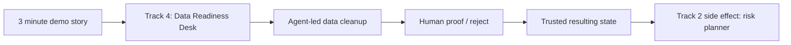
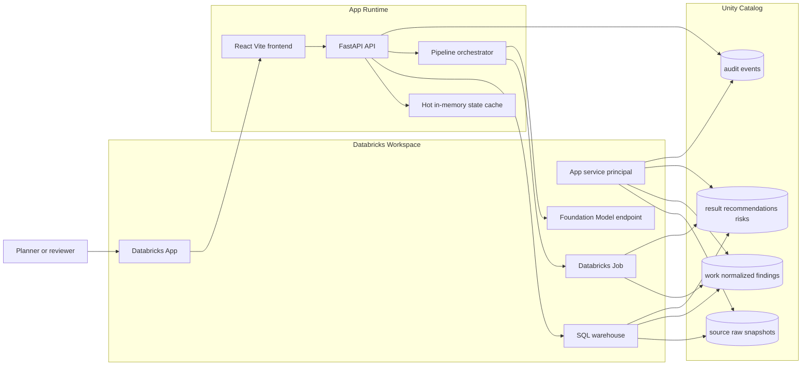
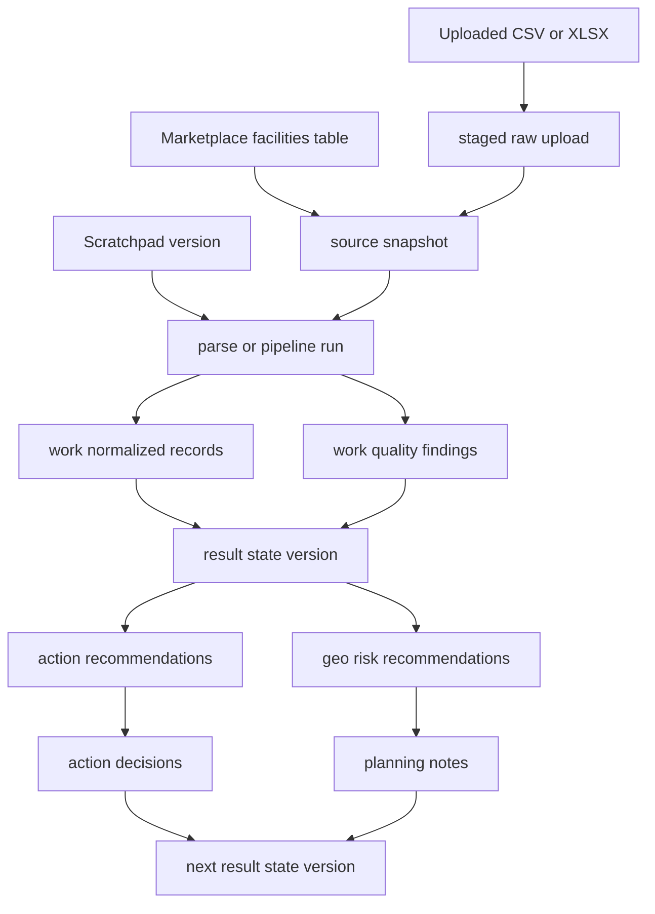
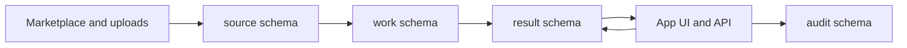
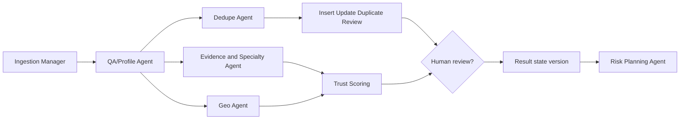
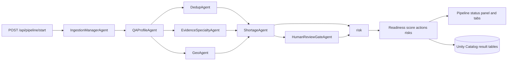
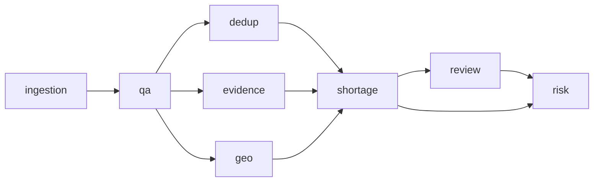
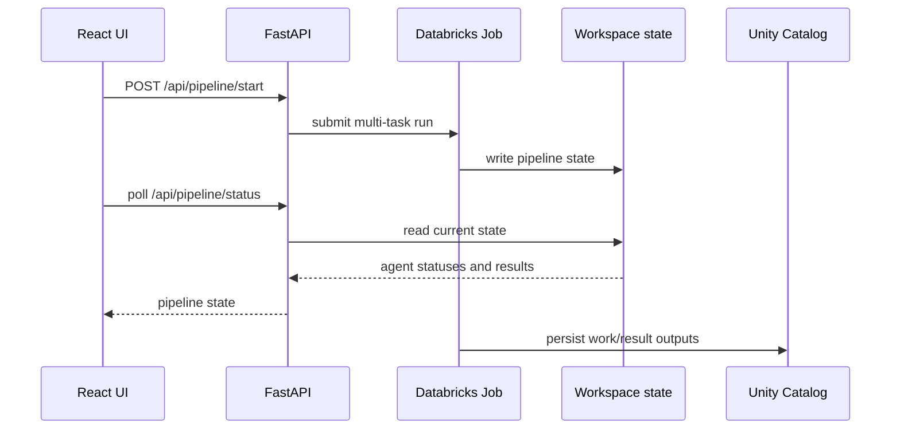

# Data Readiness Desk Build Plan

## One-line Story

Build a Databricks App for non-technical healthcare planners that turns 10,000 messy India healthcare facility records into a trusted action queue, then rolls those fixes into risk-aware planning recommendations for medical deserts.

Primary challenge track: **Track 4 - Data Readiness Desk**

Downstream outcome: **Track 2 - Medical Desert Planner**

## Top-Level Demo Posture

We are solving **Track 4** with **Track 2 in mind**. The product story is not "here is another dashboard." It is: messy scraped healthcare data should flow through an agent-led readiness pipeline, with humans only approving or rejecting material findings, and the planning-risk view should emerge as a side effect of making the data trustworthy.

For a three-minute demo, the arc is:

1. Start with the current messy dataset and show that it cannot yet be trusted for planning.
2. Drop in or stage new data from a file, website scrape, or update feed.
3. Run the agent pipeline: ingest, QA, dedupe, evidence, geo, shortage, review gate, risk.
4. Show the system found the problems automatically and separated safe fixes from human-review items.
5. Show the downstream planning effect: which places, doctors, facilities, or specialties now look risky because the cleaned/trust-weighted data says so.



## Problem We Are Solving

The source dataset has useful facility information, but it is not clean enough to trust for planning. Facility names may be duplicated, locations may be sparse or inconsistent, descriptions may contain uneven claims, and claimed capabilities may contradict structured fields.

The app answers:

- What is wrong with this dataset?
- Which records should a human review first?
- Which issues can an AI agent fix automatically?
- How much did data readiness improve after deduplication and cleanup?
- Where might planners still have high-risk care gaps after accounting for messy data?

## Target Users

- NGO coordinators deciding where to send field teams.
- Healthcare planners evaluating service coverage by geography.
- Analysts who need evidence without writing SQL.
- Data stewards who need a review queue instead of a raw spreadsheet.

## Product Promise

"Drop in messy facility data. Get a measurable trust score, a prioritized cleanup queue, evidence for every recommendation, and a planning-ready view of high-risk locations and doctors."

## Demo Flow

1. **Open Dashboard**
   - Show the current dataset readiness KPI.
   - Example headline: `Current data consistency: 62%`
   - Show estimated improvement after recommended fixes.
   - Example headline: `Expected improvement after dedupe and high-confidence fixes: +18%`

2. **Import More Data**
   - User uploads XLS/XLSX/CSV facility files.
   - App validates columns, previews rows, and maps uploaded fields into the canonical facility schema.
   - Uploaded records are staged, profiled, and compared against existing records before merge.
   - Demo artifact: `demo/data_readiness_demo_import.xlsx` contains 12 rows derived from the checked-in facility data with intentional duplicates, sparse location fields, weak capability claims, and suspicious metadata.

3. **Profile and Deduplicate**
   - Detect exact duplicates.
   - Detect fuzzy duplicates across facility name, city, district, PIN code, address, phone, and specialties.
   - Group likely duplicate clusters.
   - Recommend merge actions with confidence and evidence.

4. **Review Recommendations and Actions**
   - Surface sparse fields, missing location data, suspicious claims, contradictions, and inconsistent specialties.
   - Split recommendations into:
     - `Auto-fix candidates`
     - `Needs human confirmation`
     - `Planning risk warnings`

5. **Act on Recommendations**
   - User approves, edits, rejects, or saves recommendations.
   - AI agent can auto-fix high-confidence issues such as canonical names, whitespace cleanup, obvious duplicate merges, normalized specialties, and standardized location labels.
   - Ambiguous issues stay in the human review queue.

6. **Show Planning Outcome**
   - App translates cleaned, trust-weighted data into risk recommendations.
   - Example: "Look at XYZ district and these doctors/facilities because maternity evidence is weak, records are sparse, and nearest trusted alternative is far away."

## Three-Minute Demo Script

1. "We picked Track 4 because the real blocker is trust: this facility dataset is messy enough that a planner should not use it raw."
2. "The app opens on the current dataset, current readiness numbers, and the problems dragging planning quality down."
3. "Now we drop in more data. For the demo, we use `demo/data_readiness_demo_import.xlsx`, a 12-row XLSX with exact duplicates, near duplicates, sparse locations, weak NICU/emergency claims, and suspicious metadata."
4. "Instead of asking a human to clean rows manually, the Databricks agent workflow does the first pass: ingestion, QA, dedupe, evidence extraction, geo checks, shortage analysis, and a review gate."
5. "The output is a proof/reject queue: safe fixes can be accepted quickly, risky changes are held for human confirmation, and every item carries evidence and confidence."
6. "As a side effect of that trusted resulting state, the risk planner shows where care gaps may be real versus where we are just looking at bad or sparse data."
7. "That is the end-to-end promise: Track 4 cleanup creates the Track 2 planning surface."

## Demo Import Workbook

The repository includes a purpose-built XLSX for click-through demos:

- File: `demo/data_readiness_demo_import.xlsx`
- Generator: `scripts/create_demo_import.py`
- First sheet: `Facilities_Import`, which is the sheet parsed by `POST /api/import/preview`
- Second sheet: `Demo_Notes`, which explains the intended demo beats

The workbook intentionally includes:

- Exact existing-name duplicates, such as `Fortis Hospital, Gurugram`, `All India Institute of Medical Sciences Patna`, `HCG Manavata Cancer Centre`, and `Civil Hospital`.
- Near duplicates and related-site ambiguity, such as `Fortis Hospital Gurgaon`, `AIIMS Patna Emergency Annex`, and `City Care Hosp.`.
- Sparse location rows with blank city or PIN code.
- Weak or suspicious clinical claims around NICU, emergency, trauma, surgery, oncology, and maternity.
- A suspicious `yearEstablished` value and sparse operating fields for review storytelling.

Latest local validation with `AGENT_LLM_ENABLED=false`:

- 12 incoming rows parsed from the XLSX.
- All eight agents completed.
- Ingestion reported 3 row-quality flags.
- Dedup reported 4 exact duplicate decisions.
- HumanReviewGate reported 30 review items and crossed the material planning impact threshold.

## UX and UI Mockups

The app should feel like a Databricks-native operational dashboard: dense, calm, evidence-first, and optimized for repeated review work. The MVP should use **three primary tabs** instead of a deep navigation tree:

- `Current State`
- `Import + Pipeline`
- `Actions`
- `Risk Recommendations`

This keeps the hackathon story clean: first show the current dataset mission control view, then import/stage data and run the cleansing pipeline, then show what the agents found and what needs proof/reject, then show what the cleaned evidence means for planning.

Decision note from the 2026-06-15 demo review: import belongs with the current dataset/current state workflow, not inside Actions. Actions should be the prioritized list of what is broken and what the user should approve, reject, comment on, or assign.

Databricks Apps assumptions:

- Build the app as a FastAPI backend serving a Vite/React frontend.
- Use Databricks workspace auth instead of a separate login screen.
- Add an optional app-level Basic Auth gate for demo-link sharing.
- Read and write through Unity Catalog tables.
- Keep long-running profiling, dedupe, and AI extraction jobs behind buttons with visible run status.
- Use Databricks SQL or Spark-backed tables for persisted outputs, not only local JSON state.
- Make the UI usable in a browser tab embedded in the Databricks workspace.

### Global App Frame

```text
+----------------------------------------------------------------------------------+
| Data Readiness Desk                                   Catalog: dais_2026          |
| Track 4 cleanup -> Track 2 planning                   Last run: 2026-06-15 09:42  |
+----------------------------------------------------------------------------------+
| [Current State] [Import + Pipeline] [Actions] [Risk Recommendations]              |
+----------------------------------------------------------------------------------+
| Page content                                                                      |
+----------------------------------------------------------------------------------+
```

Global controls:

- Catalog/schema selector.
- Dataset/table selector.
- Date or run selector.
- `Run Profile` button.
- `Save Snapshot` button.
- Status pill: `Sample`, `Staged`, `Live`, or `Needs refresh`.

Global design rules:

- Use compact cards only for metrics and repeated row summaries.
- Use full-width tables for review workflows.
- Use status colors sparingly: red for critical, amber for review, green for trusted, gray for unknown.
- Never hide uncertainty; show confidence beside every recommendation.
- Keep every recommendation tied to source evidence.

### Tab 1: Current State Mockup

Purpose: This is the landing page. It shows the current dataset, current numbers, data readiness score, executive summary, and dataset preview before planning.

```text
+----------------------------------------------------------------------------------+
| Current State                                                                    |
| What we know right now about the facility dataset                                 |
+-------------------+-------------------+-------------------+----------------------+
| Consistency Score | Expected Lift     | Duplicate Clusters| Human Review Queue   |
| 62%               | +18 pts           | 428               | 1,284 records        |
| Needs work        | After safe fixes  | 96 high impact    | 312 critical         |
+-------------------+-------------------+-------------------+----------------------+
| Records 10,000    | States 28         | Districts 612     | Sparse Locations 931 |
+-------------------+-------------------+-------------------+----------------------+
| Current Data Stats                                                               |
| Completeness 74% | Dedupe Health 51% | Location Quality 68% | Evidence 55%       |
+----------------------------------------------------------------------------------+
| Top Drivers of Low Trust                                                         |
| [bar] Duplicate records                 31% of penalty                          |
| [bar] Missing PIN/district              22% of penalty                          |
| [bar] Weak capability evidence          19% of penalty                          |
| [bar] Contradictory specialty claims    14% of penalty                          |
+----------------------------------------------------------------------------------+
| Current Dataset Preview                                                          |
| facility_name | district | pin_code | specialties       | readiness_flags        |
| City Care     | Jaipur   | 302001   | ICU, emergency    | possible duplicate     |
| Shree Mat.    | Jaipur   | blank    | maternity         | weak NICU evidence     |
| Apex Hosp.    | Patna    | 800001   | emergency surgery | missing source date    |
+----------------------------------------------------------------------------------+
| Import: [Drop XLS/XLSX/CSV] [Validate Import] [Run Agent Pipeline]                |
| Primary actions: [Run Profile] [Open Actions] [Export Preview CSV]                |
```

Key interactions:

- Clicking a KPI filters the dataset preview and recommendation list.
- Clicking a driver switches to `Actions` with that issue type selected.
- `Run Profile` recomputes the latest readiness snapshot.
- `Validate Import` previews the workbook/CSV before running the agent pipeline.

Implementation notes:

- Use React components for headline KPI cards.
- Use CSS progress bars for score components.
- Use a table component for the current dataset preview.
- Read state from `GET /api/state`.
- Persist KPI snapshots to `readiness_kpi_snapshot`.

### Tab 2: Import + Pipeline Mockup

Purpose: This is the cleansing workbench. It owns XLS/XLSX/CSV import, scratchpad context, and pipeline execution before any trusted state changes.

Key interactions:

- User uploads XLS/XLSX/CSV and previews parsed rows.
- Scratchpad notes/tags can be saved and used to trigger re-parse.
- User runs the eight-agent pipeline.
- Agent cards show ingestion, QA, dedupe, evidence, geo, shortage, review gate, and risk status.

### Tab 3: Actions Mockup

Purpose: This is the Track 4 workbench output. It shows the list of recommendations and actions found in the current/staged data. Dedupe, findings, and human review live here as sections.

```text
+----------------------------------------------------------------------------------+
| Actions                                                                          |
| Review the recommended fixes and proof/reject material findings                   |
+----------------------------------------+-----------------------------------------+
| Latest Pipeline Run                    | Review Queue                             |
| Ingested rows: 12                      | Needs human review: 30                   |
| Duplicate decisions: 4                 | Auto-fix ready: 8                        |
| Row-quality flags: 3                   | Planning-impacting: 3                    |
| [Open Current Import] [Run Again]      | [Export Review CSV]                      |
+----------------------------------------+-----------------------------------------+
| Column Mapping                                                                  |
| Uploaded column        -> Canonical field           Status                       |
| Hospital Name          -> facility_name             ok                           |
| City                   -> city                      ok                           |
| Services               -> description               review                       |
| Contact                -> phone                     ok                           |
| LatLong                -> latitude/longitude         parse needed                 |
+----------------------------------------------------------------------------------+
| Preview and Validation                                                           |
| Row | facility_name | district | pin_code | issue                                |
| 12  | City Care     | blank    | 302001   | Missing district                    |
| 19  | Apex Hosp.    | Jaipur   | 302001   | Possible duplicate                  |
+----------------------------------------------------------------------------------+
+----------------------------------------------------------------------------------+
| Recommendations / Actions Found in the Data                                      |
| Filters: [Priority v] [Owner v] [Issue Type v] [State v] [Confidence v]           |
+----------------------------------------------------------------------------------+
| Priority | Recommendation                         | Owner    | Lift | Status      |
| P0       | Merge 3 City Care duplicate records     | Human    | +3.2 | Needs review|
| P0       | Normalize 412 district spellings         | AI agent | +2.4 | Ready       |
| P1       | Confirm NICU claim at Shree Maternity    | Human    | +1.8 | Open        |
| P1       | Standardize oncology specialty labels    | AI agent | +1.1 | Ready       |
+----------------------------------------------------------------------------------+
| Selected Recommendation Detail                                                    |
| Issue: Merge 3 City Care duplicate records                                        |
| Evidence: same PIN, same phone digits, 0.92 name similarity, shared address tokens|
| AI recommendation: Merge into canonical facility entity                           |
| Human note: [                                                            ]        |
| [Approve] [Reject] [Ask Human] [Apply AI Safe Fixes] [Export Review CSV]          |
+----------------------------------------------------------------------------------+
```

Key interactions:

- User arrives here after profiling the current state or running an import pipeline.
- The action table shows all recommendations found in both the current dataset and staged imports.
- Selecting an action opens the evidence/detail panel.
- AI-owned actions can be applied in batch only when confidence is high.
- Human-owned actions require approve/reject/ask-human status changes.
- Every import, action, and decision writes an audit event.

Implementation notes:

- Use React tabs and filters for queue segments.
- Use explicit API calls for inline status changes.
- Apply actions through explicit buttons, not automatic table edits.
- Store reviewer notes and status changes.
- Persist action state to `action_recommendations`.

### Confidence Model

MVP confidence is row-level, not field-level. The core question is whether a facility row is trusted enough to count in planning or send someone there. Field-level confidence is a later enhancement for high-value fields such as geocode, PIN code, specialty/capability, and provenance.

### Tab 4: Risk Recommendations Mockup

Purpose: This is the Track 2 outcome. It uses the cleaned and trust-weighted evidence to recommend locations, doctors, and facilities to investigate.

```text
+----------------------------------------------------------------------------------+
| Risk Recommendations                                                             |
| Where planners should look after accounting for messy data                        |
+--------------------------------------+-------------------------------------------+
| Map / Geography Summary                | Recommendation Detail                     |
| State: Rajasthan                       | Selected: Jaipur district                 |
| Capability: Emergency                  | Risk: Possible emergency coverage gap     |
| Trust mode: Deduped + evidence-weighted| Confidence: Medium                        |
|                                      | Why: 5 claimed emergency facilities,       |
| [district risk table or map]           | but only 2 have strong evidence and one    |
|                                      | duplicate cluster may inflate coverage.    |
+--------------------------------------+-------------------------------------------+
| Locations and Doctors/Facilities to Review                                       |
| Priority | Location/PIN | Facility/Doctor       | Reason                         | Confidence |
| P0       | 302001       | City Care Hospital    | duplicate affects coverage     | High       |
| P1       | 302004       | Shree Maternity       | NICU claim is weak             | Medium     |
| P1       | 302006       | Apex Emergency Centre | sparse description             | Medium     |
+----------------------------------------------------------------------------------+
```

Key interactions:

- User selects geography and care need.
- App shows trust-weighted coverage and uncertainty.
- Recommendations explain whether a gap is likely real or data-poor.
- User can save a planning note or export a risk list.

Implementation notes:

- Use a table-first view for MVP.
- Add maps only if coordinates are reliable.
- If coordinates are sparse, use district/PIN tables instead of pretending precision.
- Persist output to `geo_risk_recommendations`.

## Visual Design Direction

The visual direction should be practical and credible for healthcare data operations.

Layout:

- Target top-level tabs: `Current State`, `Import + Pipeline`, `Actions`, and `Risk Recommendations`.
- Page title and short context line at top.
- Main filters in a compact horizontal row.
- KPI cards across the top of the landing tab.
- Tables should take most of the width.
- Evidence panels should appear below or beside selected rows.

Palette:

- Background: white or near-white.
- Text: dark neutral.
- Accent: Databricks-style red/orange only for primary actions and selected states.
- Status colors: green, amber, red, gray.
- Avoid a one-color blue or purple analytics theme.

Typography:

- Use app-local CSS with compact dashboard typography.
- Keep headings compact.
- Use short labels in tables and cards.

Component rules:

- Buttons for clear commands: `Run Profile`, `Stage Records`, `Approve Merge`, `Apply AI Safe Fixes`.
- Select boxes for filters and column mapping.
- Tabs for queue states.
- Detail panels for evidence and source rows.
- Progress bars for score components.
- Dataframes/editors for work queues.

Empty states:

- No profile run: show `Run Profile` as the primary action.
- No upload staged: show the upload control and expected file types.
- No findings: show that the current filter has no issues, not that the dataset is perfect.
- No risk output: ask the user to select a geography and capability.

Loading states:

- Profile run: `Profiling completeness, duplicates, contradictions, and capability evidence...`
- Dedupe run: `Building candidate clusters and scoring match evidence...`
- AI extraction: `Extracting capability evidence from descriptions...`
- Save: `Writing decisions to Unity Catalog...`

Error states:

- Missing warehouse or permissions: explain which table or operation failed.
- Upload parse error: show filename, row number if available, and expected format.
- Save failure: keep user decisions in session and provide retry.
- Empty source table: ask user to choose another table or upload a file.

## Core Tab Requirements

### 1. Current State

Purpose: The landing tab. Let a planner understand the current dataset, update scratchpad context, import/stage new data, and trigger the pipeline before cleanup decisions.

Widgets:

- Data consistency KPI.
- Estimated KPI lift from recommended fixes.
- Duplicate cluster count.
- High-risk records needing review.
- Sparse geography count.
- Suspicious capability claim count.
- Current dataset stats: records, states, districts, sources, last profile run.
- Dataset preview with readiness flags.
- XLS/XLSX/CSV upload preview.
- Import readiness and required field checks.

Primary CTA:

- `Open Recommendations`

Secondary CTAs:

- `Run Profile`
- `Validate Import`
- `Run Agent Pipeline`

### 2. Import + Pipeline

Purpose: Let users drop more data into the cleansing workflow, adjust scratchpad context, and run the agent pipeline.

Features:

- XLS/XLSX/CSV upload.
- Preview of first 50 rows.
- Required field validation.
- Import quality score before commit.
- Scratchpad View/Edit and save.
- Trigger re-parse.
- Run pipeline in analysis or ingest mode.
- Agent status cards.

### 3. Actions

Purpose: Let users act on the recommendations found in the current and staged data.

Features:

- Recommendation/action list.
- Dedupe cluster review.
- Evidence drawer for selected action.
- AI safe-fix batch action.
- Human review decisions.
- Comments and proof/reject reason capture.
- Owner/reviewer assignment.
- Export review CSV.
- Audit event capture.

Canonical columns:

- `facility_id`
- `facility_name`
- `address`
- `state`
- `district`
- `city`
- `pin_code`
- `latitude`
- `longitude`
- `phone`
- `specialties`
- `description`
- `claimed_capabilities`
- `source`
- `last_updated`

Candidate matching signals:

- Normalized facility name similarity.
- Same or nearby PIN code.
- Same phone number.
- Same address tokens.
- Same district/city/state.
- Same specialty list.
- Geospatial distance if coordinates exist.

Finding types:

- Duplicate facility.
- Missing or weak location.
- Suspicious capability claim.
- Capability contradiction.
- Sparse description.
- Missing specialty.
- Conflicting specialty.
- Facility type mismatch.
- Outlier location.
- Low evidence for high-impact service.

Each finding includes:

- Severity.
- Confidence.
- Affected field.
- Recommended action.
- Evidence from structured fields and free text.
- Suggested owner: `AI agent` or `Human reviewer`.
- Planning impact.

Action list columns:

- Priority.
- Facility or cluster.
- Issue.
- Recommendation.
- Confidence.
- Evidence.
- Suggested action.
- Owner.
- Status.

Statuses:

- `Open`
- `Auto-fixed`
- `Needs review`
- `Approved`
- `Rejected`
- `Saved for later`

### 3. Risk Recommendations

Purpose: Connect Track 4 cleanup to Track 2 planning.

This screen does not pretend the data is perfect. It shows planning recommendations with uncertainty.

Recommendation examples:

- "XYZ district may be underserved for emergency care because trusted emergency evidence is low and facility descriptions are sparse."
- "Review these doctors/facilities before planning outreach because duplicate clusters may inflate apparent coverage."
- "This PIN code appears data-poor rather than truly underserved; collect more data before making a resource decision."

Signals:

- Trust-weighted facility count by geography.
- Capability evidence strength.
- Duplicate-adjusted coverage.
- Sparse-data penalty.
- Location confidence.
- Distance to nearest trusted facility.
- Human-review backlog in that geography.

## Readiness KPI

The headline KPI should be understandable, measurable, and explainable.

Proposed metric:

```text
data_consistency_score =
  0.25 * completeness_score
+ 0.20 * duplicate_health_score
+ 0.20 * contradiction_score
+ 0.15 * location_quality_score
+ 0.10 * capability_evidence_score
+ 0.10 * provenance_score
```

Where:

- `completeness_score`: required fields present and usable.
- `duplicate_health_score`: records are not likely duplicates.
- `contradiction_score`: structured and text claims do not conflict.
- `location_quality_score`: location fields are specific and valid.
- `capability_evidence_score`: capability claims have supporting evidence.
- `provenance_score`: source and update metadata are available.

Demo phrasing:

```text
Current data consistency: 62%
After recommended dedupe and auto-fixes: 80%
Estimated improvement: +18 points
```

The app should show exactly which fixes contribute to the lift.

## AI Agent Behavior

The AI agent should be useful but cautious.

Auto-fix allowed:

- Normalize whitespace and capitalization.
- Standardize common specialty labels.
- Standardize known state/district names.
- Merge exact duplicates.
- Merge very high-confidence duplicates if evidence is strong.
- Extract claimed capabilities from descriptions with evidence snippets.
- Suggest canonical facility names.

Human confirmation required:

- Ambiguous duplicate merges.
- Contradictory clinical capability claims.
- Records with planning impact above a configured threshold.
- Location changes that move a facility across district/city/PIN.
- Any recommendation with low or medium confidence.

Every AI recommendation must include:

- What changed.
- Why it changed.
- Evidence.
- Confidence.
- Undo path.

## Evidence Model

For each facility and capability, store evidence separately from conclusions.

Suggested capability labels:

- ICU
- NICU
- Emergency
- Maternity
- Trauma
- Oncology
- Dialysis
- Surgery
- Radiology
- Blood bank

Evidence fields:

- `capability`
- `claim_status`: `strong`, `partial`, `weak`, `suspicious`, `none`
- `source_field`
- `evidence_text`
- `confidence`
- `reason`
- `created_at`

This lets the app communicate uncertainty honestly and lets planners inspect why a claim was trusted or flagged.

## Data Architecture

### Overall System Diagram



### Source State vs Resulting State

The app has two different data states and they must not be mixed:

1. **Source state**
   - The original Marketplace data and any uploaded files.
   - Treated as immutable input.
   - Can be snapshotted and re-parsed, but not edited in place.
   - Stored as Bronze/raw tables plus source snapshot metadata.

2. **Resulting state**
   - The app-owned planning/review state produced from a source snapshot plus scratchpad instructions.
   - Users can mutate it by approving actions, rejecting recommendations, adding comments, changing tags, and saving planning notes.
   - All recommendations and risks are computed only from the resulting state, not directly from raw source rows.
   - Stored as Silver/Gold tables with run IDs, state version IDs, and append-only decision events.

Workflow:



Basic version-control rules:

- Never update source rows in place.
- Every re-parse creates a new `run_id`.
- Every materialized result creates a new `state_version_id`.
- User/AI mutations are append-only events.
- The app reads the latest active result state by default.
- Users can compare result state versions before/after a re-parse.
- Promotion to "planning-ready" is a metadata change, not a rewrite.

### Unity Catalog Layout

Recommended default:

- Create one new app-owned catalog if permissions allow: `dais_readiness_desk`.
- If catalog creation is not allowed, create a schema under an existing workspace/project catalog: `<existing_catalog>.dais_readiness_desk`.
- Do not write into the Marketplace source catalog.

Recommended schemas:

- `source`: immutable source snapshots and uploaded raw files.
- `work`: parsed/normalized/intermediate outputs.
- `result`: versioned app state, recommendations, risks, decisions, and notes.
- `audit`: run logs and user/AI event history.



Naming pattern:

```text
dais_readiness_desk.source.*
dais_readiness_desk.work.*
dais_readiness_desk.result.*
dais_readiness_desk.audit.*
```

If using an existing catalog:

```text
<existing_catalog>.dais_readiness_source.*
<existing_catalog>.dais_readiness_work.*
<existing_catalog>.dais_readiness_result.*
<existing_catalog>.dais_readiness_audit.*
```

### Bronze Tables

Raw and staged data.

- `source.source_snapshots`
- `source.raw_facilities_snapshot`
- `source.raw_uploaded_files`
- `source.raw_uploaded_rows`

### Silver Tables

Cleaned and normalized data.

- `work.parse_runs`
- `work.facility_records_normalized`
- `work.facility_duplicate_candidates`
- `work.facility_entity_clusters`
- `work.facility_capability_evidence`
- `work.data_quality_findings`

### Gold Tables

Planner-ready outputs.

- `result.result_state_versions`
- `result.facility_entities`
- `result.readiness_kpi_snapshot`
- `result.action_recommendations`
- `result.geo_risk_recommendations`
- `result.scratchpad_versions`
- `result.reviewer_notes`
- `result.action_decisions`

### Audit Tables

Append-only operational history.

- `audit.app_events`
- `audit.reparse_events`
- `audit.import_events`
- `audit.decision_events`

## AI Pipeline Architecture

The current app supports a multi-agent AI re-parse pipeline triggered by `POST /api/pipeline/start`. It runs in two modes controlled by `PIPELINE_MODE`.

The 2026-06-15 design session refined the target architecture from a flat agent list into an ingestion-led workflow. The design note is saved at `docs/design-session-2026-06-15-agent-architecture.md`.

Current skeleton architecture:



Implemented skeleton workflow:



### Local mode (default, `PIPELINE_MODE=local`)

Runs inside the FastAPI process using `asyncio`:



State is written to `app/state/pipeline_{id}.json` and tracked through a `pipeline_current.json` pointer. The frontend polls `GET /api/pipeline/status/{id}` every 3 seconds during execution.

### Databricks mode (`PIPELINE_MODE=databricks`)

Triggers a multi-task Databricks Job:

- Task 1: `ingestion` (no dependency)
- Task 2: `qa` (depends on ingestion)
- Task 3: `dedup`, `evidence`, and `geo` (depend on qa)
- Task 4: `shortage` (depends on dedup, evidence, and geo)
- Task 5: `review` (depends on shortage plus upstream evidence)
- Task 6: `risk` (depends on review)

Each task runs `jobs/run_agent.py <agent_name> <pipeline_id>` and shares state via the Databricks Workspace API. The FastAPI app polls the job run and mirrors task states into the pipeline state JSON.



Setup: `python scripts/setup_dbx_job.py` — creates the job and writes `DATABRICKS_PIPELINE_JOB_ID` to `.env`.

### DedupAgent — two modes

The dedup agent supports **analysis mode** (standard dedup within the existing dataset) and **ingest mode** (comparing incoming records against the existing dataset).

Ingest mode is triggered by passing `incoming_records` in the pipeline start payload:
```
POST /api/pipeline/start
{"incoming_records": [...rows from upload preview...]}
```

In ingest mode, the agent returns per-record decisions:
- `insert`: new facility not in existing data
- `update`: matches an existing record; incoming data is fresher
- `duplicate`: already present with equal or better data — skip
- `review`: ambiguous match needing human inspection

### Agent outputs

- **IngestionManagerAgent**: upload/schema routing, required-field checks, column-shift suspicion, and ingest route.
- **QAProfileAgent**: completeness, sparsity, suspicious metadata, and record-level QA flags.
- **DedupAgent**: cluster merge/split/review decisions (analysis mode) or insert/update/duplicate/review per incoming record (ingest mode).
- **EvidenceSpecialtyAgent**: specialty/capability evidence extraction skeleton and claim review flags.
- **GeoAgent**: flagged records, coverage gaps, geographic summary
- **ShortageAgent**: shortage areas by state/care type, severity levels
- **HumanReviewGateAgent**: review queue triggers for ambiguous duplicates, weak evidence, geo flags, and planning-impacting issues.
- **RiskAgent**: risk matrix, executive summary, `data_readiness_score`, `planning_readiness_score`.

Detailed agent contracts and pipeline state are maintained in `app/lib/agents/SPEC.md`.

Current deploy status:

- Local agent mode is implemented.
- Local eight-agent skeleton was revalidated on 2026-06-15: Python compile passed, frontend build passed, and a local pipeline run completed `ingestion`, `qa`, `dedup`, `evidence`, `geo`, `shortage`, `review`, and `risk`.
- Local API-style end-to-end smoke test is implemented at `scripts/smoke_local_e2e.py` and passes against the demo XLSX import path.
- Databricks Job mode is scaffolded with `scripts/setup_dbx_job.py`.
- Databricks Job mode is **not verified deployed** until `DATABRICKS_PIPELINE_JOB_ID` is created, app env is updated to `PIPELINE_MODE=databricks`, and an end-to-end run completes.
- Deployed skeleton currently uses `PIPELINE_MODE=local` and `AGENT_LLM_ENABLED=false` for predictable click-through behavior.

Local smoke command:

```bash
.venv/bin/python scripts/smoke_local_e2e.py
```

Expected marker:

```text
LOCAL_E2E_SMOKE_OK
```

### LLM backend

Agents use Databricks Foundation Models via OpenAI-compatible endpoint:

```python
OpenAI(
    api_key=<DATABRICKS_TOKEN>,
    base_url=f"https://{DATABRICKS_HOST}/serving-endpoints",
)
```

Default model: `databricks-meta-llama-3-3-70b-instruct` (override with `DATABRICKS_LLM_MODEL`).

### Pipeline state shape

```json
{
  "pipeline_id": "a3f8bc1d2e",
  "status": "running|completed|failed",
  "mode": "analysis|ingest",
  "started_at": "...",
  "completed_at": "...",
  "context": {"incoming_records": [...]},
  "agents": {
    "dedup":    {"status": "completed", "result": {...}, "started_at": "...", "completed_at": "..."},
    "geo":      {"status": "running",   "started_at": "..."},
    "shortage": {"status": "pending"},
    "risk":     {"status": "pending"}
  }
}
```

### Pipeline API routes

- `POST /api/pipeline/start` — start a pipeline run; optional body `{"mode": "local|databricks", "incoming_records": [...]}`
- `GET /api/pipeline/status` — current (most recent) pipeline state
- `GET /api/pipeline/status/{pipeline_id}` — specific run state

## Suggested Databricks Stack

- Databricks App served by FastAPI.
- Vite/React frontend for the rich three-tab workflow.
- FastAPI API routes for scratchpad saves, upload previews, re-parse triggers, action decisions, pipeline control, and risk outputs.
- Unity Catalog tables for Bronze/Silver/Gold data.
- Databricks SQL for aggregations and KPI queries.
- Databricks Foundation Models (OpenAI-compatible `/serving-endpoints`) for AI agents.
- Databricks multi-task Jobs for pipeline execution in Databricks mode.
- MLflow or table-based audit logs for recommendation runs.

## Current Implementation

The current app is a clickable Databricks App skeleton with a local/offline mode and a DBX/Unity Catalog default mode:

- FastAPI backend in `app/server.py`.
- React/Vite frontend in `app/frontend/`.
- Databricks App command in `app/app.yaml`.
- Hot in-memory `/api/state` cache with background refresh and warm demo fallback.
- Local scratchpad state in `app/state/scratchpad.md`.
- Local/generated re-parse state in `app/state/last_run.json`.
- Source/state loader in `app/lib/store.py` for checked-in CSV, Unity Catalog, and demo fallback modes.
- Mock profiling, recommendation, and risk generator in `app/lib/reparser.py`.
- Multi-agent pipeline in `app/lib/pipeline.py` and `app/lib/agents/`.
- Databricks Job task entrypoint in `app/jobs/run_agent.py`.
- Databricks Foundation Models client in `app/lib/llm.py`.
- Deployment helper in `run.sh` and Databricks Job setup script in `scripts/setup_dbx_job.py`.

Current workflow:

1. In checked-in source mode, app loads the downloaded facilities table from `data/raw/.../facilities/facilities.csv.gz`.
2. In Databricks source mode, app reads facilities from `APP_SOURCE_CATALOG.APP_SOURCE_SCHEMA.APP_SOURCE_TABLE`.
3. User edits the Markdown scratchpad.
4. User saves or triggers re-parse.
5. FastAPI regenerates profile metrics, actions, tags, and risk recommendations.
6. In local state mode, resulting state is written to `app/state`.
7. In Databricks state mode, resulting state is written to `APP_RESULT_CATALOG.result.*` and `APP_RESULT_CATALOG.audit.*`.
8. React UI refreshes the three tabs from `GET /api/state`.

Current data backend modes:

- `APP_SOURCE_MODE=checked_in`: source is the checked-in/downloaded CSV, with a tiny demo fallback.
- `APP_SOURCE_MODE=unity_catalog`: source is the Databricks Unity Catalog facilities table.
- `APP_STATE_MODE=local`: scratchpad, parse output, decisions, and notes live in `app/state`.
- `APP_STATE_MODE=unity_catalog`: scratchpad, result state, recommendations, risks, decisions, and audit events live in Unity Catalog.
- `APP_DATA_MODE=local`: compatibility preset for checked-in source plus local state.
- `APP_DATA_MODE=unity_catalog`: compatibility preset for Unity Catalog source plus Unity Catalog state. This is the default.

Default DBX mode:

```text
APP_DATA_MODE=unity_catalog
APP_SOURCE_MODE=unity_catalog
APP_STATE_MODE=unity_catalog
```

Useful local hybrid:

```text
APP_DATA_MODE=local
APP_SOURCE_MODE=unity_catalog
APP_STATE_MODE=local
```

Checked-in/offline click-through mode:

```text
APP_DATA_MODE=local
APP_SOURCE_MODE=checked_in
APP_STATE_MODE=local
```

Databricks deployment target:

```text
APP_DATA_MODE=unity_catalog
APP_SOURCE_MODE=unity_catalog
APP_STATE_MODE=unity_catalog
APP_SOURCE_CATALOG=databricks_virtue_foundation_dataset_dais_2026
APP_SOURCE_SCHEMA=virtue_foundation_dataset
APP_SOURCE_TABLE=facilities
APP_RESULT_CATALOG=dais_readiness_desk
```

Runtime behavior:

- `/api/state` is cache-first from a user-experience perspective.
- If DBX/UC state loading is slow or unavailable, the app serves in-memory cached state or a warm demo state and refreshes in the background.
- The main UI should not show full-width backend failure messages during normal use.
- `/api/status` exposes cheap cache status.
- `/api/diagnostics` is reserved for explicit catalog/table debugging.
- Databricks App sharing should be set to `Anyone in my organization can use` for the demo workspace unless stricter sharing is required.

Current API routes:

- `GET /api/health`
- `GET /api/config`
- `GET /api/status`
- `GET /api/diagnostics`
- `GET /api/state`
- `POST /api/scratchpad`
- `POST /api/reparse`
- `POST /api/import/preview`
- `POST /api/actions/{action_id}/decision`
- `POST /api/pipeline/start` — body: `{"mode": "local|databricks", "incoming_records": [...]?}`
- `GET /api/pipeline/status` — most recent pipeline state
- `GET /api/pipeline/status/{pipeline_id}` — specific run state

Current app-level auth:

- Databricks Apps already enforce workspace/app permissions before the FastAPI app runs.
- For demo workspace access, use Databricks App `Share` -> `Anyone in my organization can use`.
- Basic Auth middleware lives in `app/server.py`.
- It is optional and disabled by default with `APP_BASIC_AUTH_ENABLED=false`.
- It can be enabled with `APP_BASIC_AUTH_ENABLED=true`.
- Credentials are read from `APP_BASIC_AUTH_USERNAME` and `APP_BASIC_AUTH_PASSWORD`.
- `/api/health` stays unauthenticated for deployment smoke checks.
- In Databricks Apps, store the password as a Databricks secret and pass it through `app.yaml` using `valueFrom`.

Local run commands:

```bash
cd app/frontend
npm install
npm run build
cd ..
../.venv/bin/uvicorn server:app --host 127.0.0.1 --port 8000
```

## App Skeleton

```text
app/
  app.yaml
  requirements.txt        # includes openai>=1.0.0
  server.py
  frontend/
    index.html
    package.json
    vite.config.js
    src/
      main.jsx
      styles.css
    dist/                 # built by: npm run build (committed for deploy)
  lib/
    databricks.py         # UC SQL connector, auth helpers, config summary
    store.py              # source/state loader (local + UC modes)
    reparser.py           # mock profiler, action/risk generator
    llm.py                # Databricks Foundation Models via OpenAI SDK
    pipeline_state.py     # pipeline state shape + local/workspace backends
    pipeline.py           # orchestrator: local asyncio or Databricks Job
    agents/
      __init__.py
      base.py             # BaseAgent with LLM helper + state transitions
      dedup.py            # DedupAgent — analysis mode + ingest mode
      geo.py              # GeoAgent — geographic quality + coverage gaps
      shortage.py         # ShortageAgent — care shortage by state
      risk.py             # RiskAgent — risk matrix + planning readiness scores
  jobs/
    run_agent.py          # Databricks Job task entrypoint
  state/
    scratchpad.md
    last_run.json         # gitignored
    pipeline_*.json       # gitignored
scripts/
  setup_dbx_job.py        # create/update the multi-task Databricks Job
run.sh                    # ui | api | dev | deploy [name] | open [name]
setup.sh                  # teammate onboarding: env, venv, DBX profile
```

## First Build Milestone

Goal: A clickable dashboard that tells the story end to end with real or sample data.

Deliverables:

- FastAPI + React/Vite Databricks App skeleton.
- `Current State` tab with KPI cards, current stats, executive summary, and dataset preview.
- `Import + Pipeline` tab with upload, scratchpad, and agent execution.
- `Actions` tab with proof/reject workflow, comments, and action table.
- Mocked or live recommendation/action table.
- `Risk Recommendations` tab with planning-risk table.
- Basic evidence drawer for one selected recommendation.
- Markdown scratchpad with save and re-parse trigger.

Acceptance criteria:

- A non-technical user can understand the current data readiness score.
- A user can upload a file and see validation feedback.
- Recommendations and duplicate issues are ranked by priority.
- Recommendations clearly say whether AI can fix them or a human should review.
- Risk recommendations separate real care gaps from data-poor regions.
- Re-parse updates metrics, actions, tags, and risk rows.

## Second Build Milestone

Goal: Replace mocked logic with real profiling and dedupe.

Deliverables:

- Read raw dataset from Unity Catalog or downloaded CSVs.
- Normalize facility names, location fields, phones, and specialties.
- Generate duplicate candidates.
- Compute readiness KPI from actual data.
- Generate action recommendations from actual findings.
- Persist user decisions.

Acceptance criteria:

- KPI changes after applying approved fixes.
- Duplicate clusters have explainable evidence.
- Findings are reproducible from source data.
- User approvals are saved.

## Third Build Milestone

Goal: Add AI-assisted evidence extraction and planning recommendations.

Deliverables:

- Extract capability evidence from free-text descriptions.
- Classify claims as strong, partial, weak, suspicious, or none.
- Create geography-level risk recommendations.
- Add uncertainty labels and evidence snippets.
- Add export/save workflow.

Acceptance criteria:

- Capability claims always show evidence.
- Risk recommendations include confidence and uncertainty.
- High-risk geographies account for sparse data and duplicate inflation.
- Saved work can be revisited.

## Demo Script

1. "We start with a messy facility dataset that looks useful but cannot yet be trusted."
2. "The app scores current data consistency at 62% and shows the exact issues pulling it down."
3. "The biggest problem is duplicate and contradictory facility records, so the app creates a prioritized review queue."
4. "High-confidence fixes can be handled by an AI agent, while risky changes ask a human to confirm."
5. "After dedupe and cleanup, consistency improves to 80%, a lift of 18 points."
6. "Now the planner view is more trustworthy: we can see which locations may have real service gaps versus which ones are simply data-poor."
7. "The final output is not just a chart. It is a saved list of recommended fixes and a second list of planning risks to investigate."

## Hackathon Judging Points

Why this fits Track 4:

- Profiles data quality.
- Finds duplicates and contradictions.
- Surfaces sparse fields and suspicious claims.
- Prioritizes high-leverage records for review.
- Lets users save or revise work.

Why this supports Track 2:

- Produces trust-weighted facility evidence.
- Avoids over-counting duplicate facilities.
- Highlights data-poor regions.
- Communicates uncertainty.
- Recommends locations and doctors/facilities to investigate.

Why it is practical:

- Starts with a dashboard a planner can understand.
- Uses Databricks tables as the system of record.
- Separates evidence from conclusions.
- Keeps humans in control for risky changes.

## Open Questions

- What is the actual facility table name in the Marketplace catalog?
- Which fields are present in the 10,000-record facility dataset?
- Are latitude and longitude included, or do we need geocoding?
- Which AI model endpoint is available in the workspace?
- Do we need role-based review permissions for NGO users versus data stewards?
- Should auto-fixes write back to the source table or only to curated Gold tables?

## Immediate Next Steps

1. Set Databricks App sharing to `Anyone in my organization can use` for the demo workspace.
2. Review and execute `app/sql/unity_catalog_state.sql`, or choose an existing writable catalog fallback.
3. Verify app/service-principal permissions for source table read, SQL warehouse use, and result/work/audit writes.
4. Smoke-test deployed `/api/status`, `/api/config`, `/api/state`, and `/api/diagnostics`.
5. Persist pipeline results into Unity Catalog (`work.*`, `result.action_recommendations`, `result.geo_risk_recommendations`).
6. Replace mock risk rows in `RiskRecommendations` tab with RiskAgent output when pipeline has completed.
7. Wire DedupAgent ingest results into the Risk Recommendations tab (post-ingest risk synthesis).
8. Add `POST /api/import/stage` and stage uploaded rows into source/work tables.
9. Add real duplicate candidate scoring in `lib/reparser.py` using actual field similarity.
10. Add export/save workflows for review CSVs, pipeline results, and planning-risk snapshots.
11. Add pagination or virtual scrolling for large dataset preview and action rows.
12. Add column mapping UI for imported files (map upload columns to canonical facility schema).
