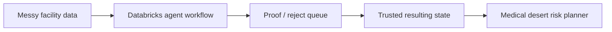
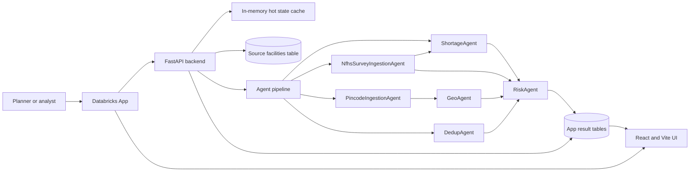
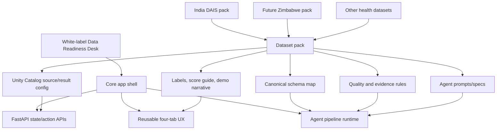
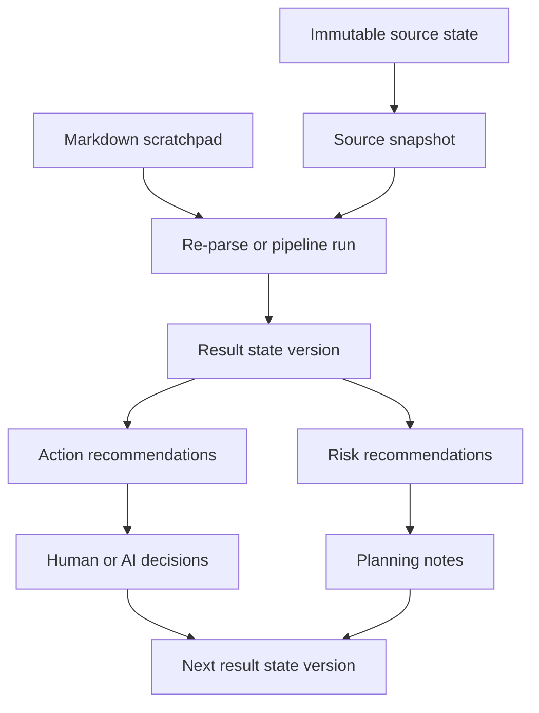
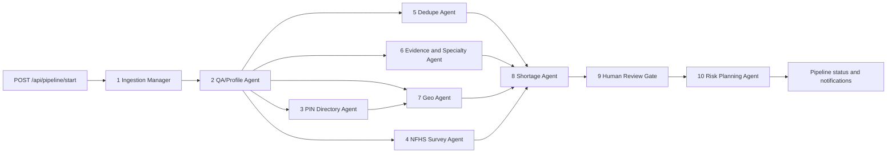

# dbx_hack_doctors

DBX 2026 hackathon workspace tooling.

## Demo Thesis

This app solves **Track 4: Data Readiness Desk** while keeping **Track 2: Medical Desert Planner** as the downstream outcome. In the demo, messy facility records flow through an agent-led readiness pipeline, humans only proof/reject material findings, and the resulting trusted state powers the risk-planning view.



## Demo Materials

The demo folder has the presenter-ready assets:

- `demo/DEMO_NARRATIVE.md`: judging story and product framing.
- `demo/DEMO_SCRIPT.md`: timed three-minute click-through.
- `demo/DEMO_CHECKLIST.md`: pre-demo validation checklist.
- `demo/SCORE_GUIDE.md`: plain-English definitions for every percentage score.
- `demo/DEVPOST_STORY.md`: Devpost-ready submission story.
- `demo/data_readiness_demo_import.xlsx`: 12-row XLSX import designed to trigger duplicate, sparse-field, weak-claim, and review-gate signals.

This repo is configured for local exploration of this Databricks workspace:

- Workspace ID: `7474647758171864`
- Cloud/region: `aws:us-west-2`
- Workspace UUID: `22b8448d-6839-4df9-9ec6-99001c769190`
- Workspace host: `https://dbc-46f0fbb0-0c1c.cloud.databricks.com`
- Local profile name: `dbx_hack_doctors`
- Catalog: `databricks_virtue_foundation_dataset_dais_2026`
- Schema: `virtue_foundation_dataset`
- Example table: `nfhs_5_district_health_indicators`

If your Databricks browser URL changes, put the current browser URL in `.env`.

## Setup

Install the local Python dependency:

```bash
uv sync
```

Create local environment config:

```bash
cp .env.example .env
```

Preferred auth is Databricks OAuth with the Databricks CLI:

```bash
databricks auth login \
  --host https://dbc-46f0fbb0-0c1c.cloud.databricks.com \
  --profile dbx_hack_doctors
```

If the CLI is not installed yet:

```bash
brew install databricks
```

Personal access token auth also works. Add `DATABRICKS_TOKEN` to `.env`, then run scripts with `--use-env-auth`.

## Explore

OAuth/profile auth:

```bash
uv run python scripts/explore_workspace.py
```

Token/env auth:

```bash
uv run python scripts/explore_workspace.py --use-env-auth
```

The explorer prints the signed-in user plus visible clusters, SQL warehouses, jobs, Unity Catalog catalogs, and workspace root objects. Some sections may be unavailable depending on your Databricks permissions.

Explore the Marketplace catalog/schema metadata:

```bash
uv run python scripts/explore_catalog.py
```

That script lists the visible tables in `databricks_virtue_foundation_dataset_dais_2026.virtue_foundation_dataset` and describes the configured table columns. Change `DATABRICKS_TABLE` in `.env` to inspect one of the other tables.

## Download Raw Data

Download every visible table in the Marketplace schema:

```bash
uv run python scripts/download_catalog.py --overwrite
```

Files are written under:

```text
data/raw/databricks_virtue_foundation_dataset_dais_2026/virtue_foundation_dataset/
```

Each table gets a compressed CSV plus `schema.json`. A schema-level `manifest.json` records the downloaded files and row counts.

Inspect the local raw files without querying Databricks:

```bash
uv run python scripts/inspect_local_data.py
```

## Databricks App Skeleton

The clickable app skeleton lives under `app/` and uses FastAPI plus a Vite/React frontend.

Build the frontend bundle:

```bash
cd app/frontend
npm install
npm run build
```

Run the app locally from the `app/` directory:

```bash
cd app
../.venv/bin/uvicorn server:app --host 127.0.0.1 --port 8000
```

Open:

```text
http://127.0.0.1:8000
```

Or run the full local dev pair from the repo root:

```bash
./run.sh dev
```

`run.sh dev` automatically chooses the next free API/UI ports if `8000` or `5173` are already occupied. You can force ports with `API_PORT=8001 UI_PORT=5174 ./run.sh dev`.

When Databricks is unavailable or you want a fully offline click-through, use:

```bash
./run.sh dev local
```

`dev local` starts the same Vite UI and FastAPI API, but forces the backend into checked-in/offline mode:

- Source data comes from the downloaded facilities CSV under `data/raw/.../facilities.csv.gz`.
- Scratchpad, parse output, decisions, and pipeline state are written to local `app/state` files.
- The 10-agent pipeline runs in-process with `PIPELINE_MODE=local`.
- LLM calls are disabled with `AGENT_LLM_ENABLED=false`, so a stray `DATABRICKS_TOKEN` does not make local agents call a serving endpoint.
- Basic Auth is disabled for local development.

Local mode is the right path for UI work, import previews, action queue decisions, risk workflow checks, and deterministic agent smoke tests while waiting on DBX credits. It does not validate Unity Catalog reads/writes, Databricks SQL auth, Databricks Jobs orchestration, Databricks Apps deployment behavior, or model-serving calls.

The Databricks App command is defined in `app/app.yaml`.

### Solution Architecture



### White-Label Dataset Packs

The app should stay reusable beyond the DAIS India healthcare dataset. The long-term product shape is a white-label readiness cockpit where each dataset family ships as a **dataset pack**: source table config, canonical schema mapping, agent specs, quality rules, score definitions, and demo copy.

For example, a future Zimbabwe healthcare dataset should not require rewriting the app. It should add a Zimbabwe facility dataset pack with country-specific geography rules, facility fields, evidence vocabulary, and risk-planning labels, while reusing the same Current State, Import + Pipeline, Actions, and Risk Recommendations workflow.





### Agent Pipeline

The app includes an ingestion-led skeleton agent workflow with **10 runtime agents/tasks**. Agent specs, state shape, runtime modes, and current persistence gaps are documented in `app/lib/agents/SPEC.md`.



Current status:

- Local in-process pipeline: implemented and clickable through `POST /api/pipeline/start`.
- Skeleton agents complete without requiring LLM calls when `AGENT_LLM_ENABLED=false`.
- Databricks multi-task Job: scaffolded by `scripts/setup_dbx_job.py`; current job id is `590750946177761`.
- Databricks App status checked on 2026-06-16: app object exists, but app compute was `STOPPED`.
- Databricks Job status checked on 2026-06-16: new runs were blocked by the workspace/account message `Triggering new runs for organization 7474647758171864 is currently disabled temporarily.`
- Deployed app pipeline mode is currently `PIPELINE_MODE=local` in `app/app.yaml`, so the deployed UI can stay clickable even while Databricks Job mode is not verified.
- Databricks Job deployment is not considered verified until `DATABRICKS_PIPELINE_JOB_ID` exists, deployed `PIPELINE_MODE=databricks`, and all 10 agent tasks complete end to end.
- The Import + Pipeline tab badge shows agent run progress/completion. Review counts such as `52` are pipeline notifications/review items, not agent counts or task failures.
- Design-session note: `docs/design-session-2026-06-15-agent-architecture.md`.
- Agent workflow rulebook:
  - `agents/ingestion_agent.md`: orchestrator and sub-agent operating prompts.
  - `docs/facilities_data_quality.md`: field cleaning, dedupe, geocoding, and scoring rules.
  - `agents/pincode_ingestion_agent.md`: PIN directory enrichment workflow and sub-agent prompts.
  - `docs/pincode_data_quality.md`: PIN lookup confidence, ambiguity, and join-safe enrichment rules.
  - `agents/nfhs_survey_ingestion_agent.md`: NFHS-5 district survey ingestion workflow and sub-agent prompts.
  - `docs/nfhs_survey_ingestion_data_quality.md`: NFHS suppression, caution-estimate, geography-key, and ingestion-quality rules.
  - `app/lib/agents/SPEC.md`: integrated contracts used by the current app agents.

### Data Backend

The app separates the source dataset from the mutable app/result state:

- `APP_SOURCE_MODE=checked_in`: read the checked-in/downloaded facilities CSV, falling back to a tiny demo dataset.
- `APP_SOURCE_MODE=unity_catalog`: read source facilities from the Databricks Unity Catalog table.
- `APP_STATE_MODE=local`: write scratchpad, parse output, decisions, and notes to local `app/state` files.
- `APP_STATE_MODE=unity_catalog`: write scratchpad versions, result states, recommendations, risks, decisions, and audit events to Unity Catalog.

`APP_DATA_MODE` still works as a preset:

- `APP_DATA_MODE=local`: `APP_SOURCE_MODE=checked_in` + `APP_STATE_MODE=local`.
- `APP_DATA_MODE=unity_catalog`: `APP_SOURCE_MODE=unity_catalog` + `APP_STATE_MODE=unity_catalog`. This is the default.

Default DBX mode:

```text
APP_DATA_MODE=unity_catalog
APP_SOURCE_MODE=unity_catalog
APP_STATE_MODE=unity_catalog
```

Local app over the real Databricks catalog, with local scratchpad/results:

```text
APP_DATA_MODE=local
APP_SOURCE_MODE=unity_catalog
APP_STATE_MODE=local
```

Checked-in/offline click-through mode:

```text
APP_DATA_MODE=local
APP_SOURCE_MODE=checked_in
APP_STATE_MODE=local
PIPELINE_MODE=local
AGENT_LLM_ENABLED=false
```

The `./run.sh dev local` shortcut applies those offline settings for the API process without changing `.env`.

Databricks source/target defaults:

```text
APP_SOURCE_CATALOG=databricks_virtue_foundation_dataset_dais_2026
APP_SOURCE_SCHEMA=virtue_foundation_dataset
APP_SOURCE_TABLE=facilities
APP_RESULT_CATALOG=dais_readiness_desk
```

Before deploying with `APP_STATE_MODE=unity_catalog`, create the app-owned UC tables using:

```text
app/sql/unity_catalog_state.sql
```

In DBX mode, `/api/state` keeps an in-memory hot state. If Unity Catalog or the SQL warehouse is slow, the app serves cached or warm demo state immediately and refreshes in the background. Use `/api/status` for the cheap cache/backend status and `/api/diagnostics` only when you want explicit catalog/table checks.

Recommended actions are typed work packets, not generic suggestions. See `docs/action-workflow-design.md` for the action payload contract, human review workflows, auto-applied agent action rules, and audit semantics.

### Sharing the Deployed Databricks App

If a workspace user sees the Databricks `Permission Required` page before the app loads, they need app-level access in Databricks. This happens before FastAPI, React, or app Basic Auth runs.

UI fix:

1. Open the Databricks app overview page.
2. Click `Share`.
3. For a demo workspace, choose `Anyone in my organization can use`.
4. Save.

Per-user or per-group fix:

1. Open the Databricks app overview page.
2. Click `Share`.
3. Add the user or group.
4. Grant `CAN USE`.
5. Save.

CLI fix:

```bash
databricks apps update-permissions dbx-hack-doctors \
  --profile dbx_hack_doctors \
  --json '{"access_control_list":[{"user_name":"person@example.com","permission_level":"CAN_USE"}]}'
```

For a group:

```bash
databricks apps update-permissions dbx-hack-doctors \
  --profile dbx_hack_doctors \
  --json '{"access_control_list":[{"group_name":"my-group","permission_level":"CAN_USE"}]}'
```

Use `update-permissions` for additive changes. Avoid `set-permissions` unless intentionally replacing the app's direct permission list.

### App-level Basic Auth

Databricks App sharing is the primary access-control path for deployed demos. The FastAPI app also includes an optional Basic Auth gate if you want an extra app-level password after Databricks workspace authentication. It is disabled by default.

Local example:

```bash
cd app
APP_BASIC_AUTH_ENABLED=true \
APP_BASIC_AUTH_USERNAME=demo \
APP_BASIC_AUTH_PASSWORD='change-me' \
../.venv/bin/uvicorn server:app --host 127.0.0.1 --port 8000
```

For Databricks Apps deployment, set:

```text
APP_BASIC_AUTH_ENABLED=true
APP_BASIC_AUTH_USERNAME=<demo username>
APP_BASIC_AUTH_PASSWORD=<secret password>
```

Do not hardcode the password in `app.yaml`. Use Databricks app environment variables backed by a secret for `APP_BASIC_AUTH_PASSWORD`.
