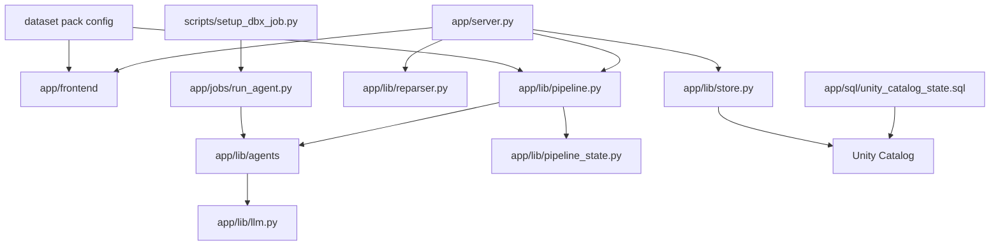

# Data Readiness Desk TODO

This is the working build-out checklist for future maintainers and AI agents. The current app is a FastAPI backend serving a Vite/React frontend.

Current local app:

```bash
cd app/frontend
npm install
npm run build
cd ..
../.venv/bin/uvicorn server:app --host 127.0.0.1 --port 8000
```

Open:

```text
http://127.0.0.1:8000
```

## Current State

Top-level product setting:

- We are solving **Track 4: Data Readiness Desk** with **Track 2: Medical Desert Planner** in mind.
- The demo promise is: agents ingest and clean messy facility data, humans only proof/reject material findings, and the trusted resulting state produces the downstream risk planner.
- The three-minute story should show Geographic Score Heatmap -> Mission Control + Row Uncertainty Distribution -> import/stage update -> agent workflow -> proof/reject actions -> risk recommendations.
- MVP confidence is row-level: decide whether a facility row is trusted enough to count in planning. Field-level confidence is a later enhancement for high-value fields only.
- Future-proof product direction: make the app white-labelable through dataset packs so another country/domain dataset, such as a Zimbabwe healthcare dataset, can reuse the same app shell with different source config, schema mapping, quality rules, agent specs, labels, and score guide.

Core files:
- `app/server.py`: FastAPI API + static React server. Includes pipeline endpoints.
- `app/frontend/src/main.jsx`: React app — four tabs, heatmap-first Current State, row uncertainty distribution, pipeline status panel with agent cards, ingest mode, actionable queue, risk handoff, and readiness-flag chips.
- `app/frontend/src/styles.css`: dashboard styling using the agreed Lava/Navy/Oat/Gray/Green/Blue palette, agent cards, queue chips, and preview readiness chips.
- `app/app.yaml`: Databricks App command and deployment env vars.
- `app/lib/databricks.py`: Databricks SQL / Unity Catalog helper, auth, config summary, and SQL cloud-fetch control.
- `app/lib/store.py`: source/state loader — local checked-in, Unity Catalog, and demo modes.
- `app/lib/reparser.py`: mock profiler, action generator, and risk generator.
- `app/lib/llm.py`: Databricks Foundation Models via OpenAI SDK (`/serving-endpoints`).
- `app/lib/pipeline_state.py`: pipeline state shape, local JSON backend, Workspace API backend.
- `app/lib/pipeline.py`: pipeline orchestrator — local asyncio mode + Databricks Job mode.
- `app/lib/agents/`: ten-agent skeleton — IngestionManager, QAProfile, PincodeIngestion, NfhsSurveyIngestion, Dedup, EvidenceSpecialty, Geo, Shortage, HumanReviewGate, Risk.
- `app/lib/agents/SPEC.md`: integrated agent contracts, source workflow refs, state shape, runtime modes, and DBX Job verification checklist.
- `agents/ingestion_agent.md`: merged fork rulebook for ingestion orchestration, cleaning, dedupe, review surface, and scoring.
- `docs/facilities_data_quality.md`: merged fork field-cleaning, dedupe, geocoding, state mapping, and data-quality baseline.
- `agents/pincode_ingestion_agent.md`: PIN directory orchestrator for post-office cleaning, coordinate parsing, PIN aggregation, ambiguity flags, and scoring.
- `docs/pincode_data_quality.md`: PIN directory baseline, confidence tiers, ambiguity rules, and join-safe facility enrichment rules.
- `agents/nfhs_survey_ingestion_agent.md`: NFHS-5 district survey orchestrator for schema, geography, indicator parsing, caveat flags, and ingestion scoring.
- `docs/nfhs_survey_ingestion_data_quality.md`: NFHS baseline, suppressed/caution cell handling, district join-key rules, and survey-context guardrails.
- `docs/design-session-2026-06-15-agent-architecture.md`: formatted transcript notes and target ingestion-led architecture.
- `docs/demo-review-2026-06-15-current-state-import-actions.md`: formatted demo review transcript notes and UX decisions.
- `docs/agent_workflow_pipeline_v2_lindsay_handoff.md`: Lindsay handoff for the v2 ten-agent trust-first workflow, row_scorer_v2, heatmap language, and product labels.
- `app/jobs/run_agent.py`: Databricks Job task entrypoint for all ten agents.
- `app/sql/unity_catalog_state.sql`: Unity Catalog DDL for source, work, result, audit schemas.
- `app/state/scratchpad.md`: seed Markdown scratchpad.
- `app/state/last_run.json`: generated local parse state, gitignored.
- `scripts/setup_dbx_job.py`: creates/updates the multi-task Databricks pipeline Job.
- `scripts/create_demo_import.py`: regenerates the small XLSX demo import workbook.
- `scripts/smoke_local_e2e.py`: local end-to-end smoke test for health/state, demo XLSX import preview, and the ten-agent pipeline.
- `demo/data_readiness_demo_import.xlsx`: 12-row demo import file that triggers duplicate, sparse-field, weak-claim, and review-gate signals.
- `run.sh`: dev/deploy helper — `ui | api | dev | deploy [name] | open [name]`.
- `setup.sh`: teammate onboarding — venv, DBX profile, env setup.
- `data/raw/.../facilities/facilities.csv.gz`: downloaded facilities table.



Completed/working now:

- [x] FastAPI + React/Vite app skeleton.
- [x] Current app tabs: `Current State`, `Import + Pipeline`, `Actions`, `Risk Recommendations`.
- [x] Target tab split from demo review implemented: import/scratchpad/pipeline separated from actions.
- [x] Local downloaded facilities source loads in local mode.
- [x] Current State KPI cards and score bars.
- [x] Markdown scratchpad save and re-parse trigger.
- [x] Scratchpad View/Edit toggle.
- [x] Rendered scratchpad view for headings, paragraphs, bullets, and tags.
- [x] Dataset preview table.
- [x] Dataset preview search UI.
- [x] Dataset preview order-by column and asc/desc UI.
- [x] Dataset preview tier and state filters, with heatmap legend tier clicks driving the preview.
- [x] Dataset preview labels sample rows against total loaded rows.
- [x] Dataset preview readiness flags render as colored chips: red missing/sparse, gray clustered, blue-gray ok/neutral.
- [x] Geographic Score Heatmap appears above Mission Control on Current State.
- [x] Geographic Score Heatmap has clickable tier legend filters and zoom controls.
- [x] Geographic Score Heatmap dots open facility pills with score/tier/reasons and links to Actions or Risk Recommendations.
- [x] Row Uncertainty Distribution replaces the old generic queue card next to Mission Control.
- [x] Row scorer v2 adds row readiness score, A/B/C/D uncertainty tiers, reason codes, and map points.
- [x] Lindsay v2 handoff added to docs and reflected in demo/product language.
- [x] Percentage scores have tooltips/ARIA labels and a demo score guide at `demo/SCORE_GUIDE.md`.
- [x] Recommendations/actions table with selected action detail.
- [x] Upload preview API for CSV/XLS/XLSX.
- [x] Mock re-parse flow regenerates profile/actions/risks.
- [x] Local Basic Auth gate, disabled by default.
- [x] Unity Catalog state DDL placeholder.
- [x] `APP_DATA_MODE=local` and `APP_DATA_MODE=unity_catalog` switch.
- [x] Unity Catalog source/target env placeholders in `app/app.yaml`.
- [x] Deploy diagnostics: `/api/config`, `/api/status`, bounded `/api/state`, and `/api/diagnostics`.
- [x] In-memory hot state cache so DBX mode keeps the dashboard clickable.
- [x] Startup state-cache prewarm in DBX mode.
- [x] Cache-first `/api/state` after live state is hydrated.
- [x] Compact backend status pill (live / refreshing / warming).
- [x] Ephemeral unsaved result state on first load when UC result tables are empty.
- [x] DBX strict source/state behavior: fallback disabled in deployed app so 3-row demo data cannot masquerade as the 10K source.
- [x] Databricks SQL cloud fetch disabled with `DATABRICKS_SQL_USE_CLOUD_FETCH=false` to avoid blocked app-runtime result chunk downloads.
- [x] `run.sh` — ui / api / dev / deploy [name] / open [name].
- [x] `setup.sh` — teammate onboarding (venv, DBX CLI, profile, .env).
- [x] Databricks Apps deploy pipeline (sync + ensure_app state machine).
- [x] Multi-agent AI pipeline skeleton — IngestionManager, QAProfile, PincodeIngestion, NfhsSurveyIngestion, Dedup, EvidenceSpecialty, Geo, Shortage, HumanReviewGate, Risk.
- [x] `PincodeIngestionAgent` is now an actual runtime pipeline agent, not only a Markdown reference.
- [x] `NfhsSurveyIngestionAgent` is now an actual runtime pipeline agent, not only a Markdown reference.
- [x] Basic agent specs and pipeline state documented in `app/lib/agents/SPEC.md`.
- [x] Sarah fork docs merged into main and promoted into the agent workflow contract.
- [x] PIN directory ingestion/data-quality docs imported and promoted into the GeoAgent/PIN enrichment workflow contract.
- [x] NFHS survey ingestion/data-quality docs imported and promoted into the survey-context workflow contract.
- [x] Unity Catalog DDL placeholders added for clean post-office, one-row-per-PIN lookup, ambiguity flags, review queue, and PIN ingestion log.
- [x] Unity Catalog DDL placeholders added for NFHS district indicators, indicator caveat flags, geography review queue, and NFHS ingestion log.
- [x] Runtime agent results include workflow refs/rule families and pipeline cards display rule-family chips.
- [x] Design session saved and linked: `docs/design-session-2026-06-15-agent-architecture.md`.
- [x] Demo review transcript saved and linked: `docs/demo-review-2026-06-15-current-state-import-actions.md`.
- [x] Dual pipeline mode: local asyncio (default) + Databricks multi-task Job.
- [x] DedupAgent ingest mode — compares uploaded records against existing dataset.
- [x] Pipeline state API: `POST /api/pipeline/start`, `GET /api/pipeline/status[/{id}]`.
- [x] Pipeline status panel in UI with per-agent cards and 3-second polling.
- [x] Pipeline tab badge now reports agent progress/completion; pipeline review counts show as contextual notifications inside Import + Pipeline instead of implying 52 agents/actions failed.
- [x] "Run ingestion pipeline" button in Import panel — passes uploaded records into the ten-agent ingestion workflow.
- [x] LLM via Databricks Foundation Models (`/serving-endpoints`, OpenAI-compatible).
- [x] Databricks Job setup script (`scripts/setup_dbx_job.py`).
- [x] Local revalidation on 2026-06-15: Python compile, Vite build, and local ten-agent pipeline smoke all pass.
- [x] Demo import XLSX generated from checked-in source data with intentional duplicate/sparse/weak-claim variations.
- [x] Demo folder filled with narrative, three-minute script, checklist, and import workbook references.
- [x] Import-driven pipeline smoke passes with demo XLSX: 12 incoming rows, PIN/NFHS guardrails, 4 duplicate decisions, 3 row-quality flags, 30+ review items.
- [x] Local API-style E2E smoke test added and passing: `scripts/smoke_local_e2e.py`.
- [x] KPI cards on `Current State` are clickable and navigate into filtered `Actions`.
- [x] Four-tab UI deployed to Databricks Apps on 2026-06-15.
- [x] Databricks multi-task Job created: `590750946177761`.
- [x] Deployed app data-load fix validated locally against configured DBX host/warehouse/source: 10,000 rows, 51 columns, `backend=live`, `fallback=False`.
- [x] Databricks Job ingestion failure diagnosed on run `92661075111108`: Spark Python task did not define `__file__` in `app/jobs/run_agent.py`.
- [x] Databricks Job entrypoint patched to resolve app path without `__file__`.
- [x] Databricks Job source read patched to use Spark `collect()` in job mode instead of Databricks SQL connector Arrow fetch.
- [ ] Databricks App compute is currently stopped: validation on 2026-06-16 returned `STOPPED` for `dbx-hack-doctors`.
- [ ] Databricks Job validation is currently blocked: validation on 2026-06-16 could not start a run because new runs for organization `7474647758171864` are temporarily disabled.
- [ ] Earlier Databricks Job validation: run `255341043566317` still failed at `ingestion`; downstream tasks were skipped. Fetch task output after workspace job runs are enabled again.
- [ ] Databricks Job mode deployed and verified end-to-end.

## Priority Next Actions

Do these first for a clean demo and a handoff-friendly build:

```mermaid
flowchart LR
  access[P0 app sharing] --> uc[P0 UC setup]
  uc --> perms[P0 DBX permissions]
  perms --> smoke[P0 deploy smoke]
  smoke --> persist[P1 pipeline persistence]
  persist --> packs[P1 dataset packs]
  packs --> risk[P1 RiskAgent UI]
  risk --> importStage[P1 import staging]
  importStage --> polish[P2 UX polish]
```



- [ ] **P0 Demo access:** set Databricks App sharing to `Anyone in my organization can use`.
- [ ] **P0 UC setup:** review and execute `app/sql/unity_catalog_state.sql`, or choose an existing writable catalog fallback.
- [ ] **P0 DBX permissions:** verify the app/service principal can:
  - [ ] read `APP_SOURCE_CATALOG.APP_SOURCE_SCHEMA.APP_SOURCE_TABLE`
  - [ ] use the configured SQL warehouse
  - [ ] write `APP_RESULT_CATALOG.work/result/audit`
- [ ] **P0 deploy smoke:** hard refresh deployed UI and verify it shows the real source catalog, `Live data`, 10,000 loaded facility records, and no `Warming cache`.
- [ ] **P0 deploy API smoke:** open deployed `/api/status`, `/api/config`, `/api/state`, and `/api/diagnostics` from an authenticated browser session.
- [x] **P0 three-minute demo story:** add `demo/DEMO_NARRATIVE.md`, `demo/DEMO_SCRIPT.md`, and `demo/DEMO_CHECKLIST.md`.
- [ ] **P0 live demo rehearsal:** verify the live app can show heatmap-first Current State, Mission Control, row uncertainty distribution, import/stage, run agents, show proof/reject queue, and show risk recommendations without narration gaps.
- [x] **P0 tab split:** separate `Import + Pipeline` from `Actions` and keep `Actions` as a dedicated proof/reject work queue.
- [x] **P0 actionable queue:** add clickable queue lanes, selected-action next steps, status-aware decision buttons, and risk-to-actions handoff.
- [x] **P0 actionable risk recommendations:** add selected recommendation detail with next step, facts to verify, linked cleanup action cards, and planner note.
- [x] **P0 DBX data-load fix:** disable SQL cloud fetch, prewarm state cache, increase timeout, and disable silent DBX fallback.
- [ ] **P1 pipeline persistence:** persist agent outputs from `app/lib/agents/` into Unity Catalog work/result tables.
- [ ] **P1 white-label dataset packs:** move hardcoded dataset labels/config/rules into pack definitions for India DAIS and future datasets.
- [x] **P1 target agents:** add skeleton Ingestion Manager, QA/Profile Agent, Evidence/Specialty Agent, and Human Review Gate.
- [x] **P1 proof/reject UX:** turn HumanReviewGate output into explicit Accept / Reject / Needs evidence controls.
- [x] **P1 action comments:** add required/free-text comment capture for accepted/rejected actions.
- [ ] **P1 risk UI:** wire RiskAgent output into the `Risk Recommendations` tab instead of mock rows.
- [ ] **P1 import staging:** add `POST /api/import/stage` and stage uploaded rows into source/work tables.
- [ ] **P1 PIN enrichment implementation:** build `pincode_post_offices_clean`, `pincode_lookup_clean`, `pincode_ambiguity_flags`, and facility enrichment joins against lookup only.
- [ ] **P1 NFHS survey implementation:** build `nfhs_district_indicators_clean`, `nfhs_indicator_quality_flags`, `nfhs_geography_review_queue`, and district-context joins with normalized keys only.
- [ ] **P1 Zimbabwe/import-other-dataset path:** define a sample non-India dataset pack contract and prove import/stage can map it into the canonical state without code changes.
- [ ] **P2 UX polish:** split React components, add table pagination, add toasts, and add remaining confidence/status chips.

## Phase 1: Make the Skeleton Feel Great

- [ ] Split `app/frontend/src/main.jsx` into components:
  - [ ] `CurrentDataset.jsx`
  - [ ] `ImportActions.jsx`
  - [ ] `RiskRecommendations.jsx`
  - [ ] `Metric.jsx`
  - [ ] `DataTable.jsx`
- [x] Add table sorting and text search for Dataset Preview.
- [x] Add Dataset Preview filters for row uncertainty tier and state.
- [ ] Add table sorting and text search for Recommendations and Risks.
- [ ] Add pagination or virtual scrolling for dataset preview and action rows.
- [x] Add visible loading states for action decisions.
- [ ] Add visible loading states for save, re-parse, and upload preview.
- [ ] Add toast/banner feedback for save success and API errors.
- [x] Add a richer selected-action side panel.
- [x] Add queue/status chips instead of raw queue text.
- [x] Add dataset preview readiness chips.
- [x] Add a Markdown preview toggle for the scratchpad.
- [x] Add "jump to Actions" behavior from Current State drivers.
- [x] Add "jump to Actions" behavior from Risk Recommendation detail.

## Phase 2: Durable Local State

- [ ] Move action decisions from in-place `last_run.json` edits into a local audit log file.
- [ ] Add `app/state/audit_log.jsonl` for:
  - [ ] scratchpad saves
  - [ ] re-parse runs
  - [ ] upload previews
  - [ ] action decisions
  - [ ] planning notes
- [ ] Add API route `GET /api/audit`.
- [ ] Add API route `POST /api/planning-notes`.
- [ ] Add a small Audit section or drawer in the UI.
- [ ] Add undo/revert for recent action decisions.

## Phase 3: Real Profiling

- [ ] Replace mock consistency scoring with real row-level confidence/readiness scoring.
- [ ] Add field-level confidence only for high-value planning fields after row-level scoring is solid.
- [ ] Compute completeness by canonical field groups:
  - [ ] identity
  - [ ] location
  - [ ] contact
  - [ ] specialties
  - [ ] capabilities
  - [ ] provenance
- [ ] Add duplicate candidate generation using:
  - [ ] normalized facility name similarity
  - [ ] cluster ID
  - [ ] phone overlap
  - [ ] PIN/city/state overlap
  - [ ] coordinate distance
  - [ ] specialty overlap
- [ ] Add contradiction detection between `specialties`, `procedure`, `equipment`, `capability`, and `description`.
- [ ] Add sparse/low-provenance source detection.
- [ ] Store profile outputs as structured records, not only summary metrics.

## Phase 4: Import Pipeline

- [ ] Add column mapping UI for uploaded XLS/XLSX/CSV.
- [ ] Add canonical schema validation.
- [ ] Add staged import storage.
- [ ] Add import duplicate check against existing facilities.
- [ ] Add "stage only" versus "merge into review queue" mode.
- [ ] Add upload source metadata:
  - [ ] source name
  - [ ] uploaded by
  - [ ] uploaded at
  - [ ] row count
  - [ ] parse errors
- [ ] Add API route `POST /api/import/stage`.

## Phase 5: Unity Catalog Persistence

- [ ] Decide deployment namespace:
  - [ ] preferred: create dedicated catalog `dais_readiness_desk`
  - [ ] fallback: create project schemas inside an existing writable catalog
- [x] Draft `app/sql/unity_catalog_state.sql`.
- [ ] Review and execute `app/sql/unity_catalog_state.sql`.
- [ ] Deploy app with `APP_SOURCE_MODE=unity_catalog` and `APP_STATE_MODE=unity_catalog`.
- [x] Split source backend mode from result/app state backend mode.
- [x] Make Databricks/Unity Catalog the default source and state mode.
- [x] Keep checked-in CSV/demo data as an explicit local/offline click-through source.
- [x] Support local app reads from Databricks catalog with local scratchpad/result state.
- [x] Add source env config:
  - [x] `APP_SOURCE_CATALOG`
  - [x] `APP_SOURCE_SCHEMA`
  - [x] `APP_SOURCE_TABLE`
- [x] Add target env config: `APP_RESULT_CATALOG`.
- [x] Add source/state mode env config:
  - [x] `APP_SOURCE_MODE`
  - [x] `APP_STATE_MODE`
- [x] Add DBX runtime env:
  - [x] `APP_SOURCE_ROW_LIMIT=10000`
  - [x] `APP_STATE_LOAD_TIMEOUT_SECONDS=45`
  - [x] `APP_STATE_CACHE_PREWARM=true`
  - [x] `APP_STATE_FALLBACK_ON_ERROR=false`
  - [x] `DATABRICKS_SQL_USE_CLOUD_FETCH=false`
- [x] Confirm source reads work with deployed DBX config from local validation: 10,000 source rows and 51 columns.
- [ ] Confirm source reads from deployed UI after authenticated hard refresh.
- [ ] Confirm target writes work in deployed Databricks App.
- [ ] Set Databricks App sharing to `Anyone in my organization can use` for the demo workspace.
- [ ] If narrower sharing is needed, grant demo users or a demo group `CAN USE` on the Databricks App.
- [x] Document app-level `Permission Required` fix in README.
- [x] Add cheap deployment/cache status endpoint: `GET /api/status`.
- [ ] Use deployed `/api/config` to verify app env:
  - [ ] `data_mode=unity_catalog`
  - [ ] `source_mode=unity_catalog`
  - [ ] `state_mode=unity_catalog`
  - [ ] source catalog/schema/table are correct
  - [ ] result catalog is correct
  - [ ] SQL warehouse is configured
  - [ ] host is configured
  - [ ] `sql_cloud_fetch=false`
  - [ ] `fallback_on_state_error=false`
- [ ] Keep Marketplace/source catalog read-only.
- [x] Treat source state and resulting state separately in app configuration:
  - [x] source state can come from checked-in data or Databricks catalog
  - [x] resulting state can be local files or Unity Catalog tables
  - [x] recommendations/actions/risks are computed from the current resulting parse state
- [ ] Define Bronze tables:
  - [ ] `source.source_snapshots`
  - [ ] `source.raw_facilities_snapshot`
  - [ ] `source.raw_uploaded_files`
  - [ ] `source.raw_uploaded_rows`
- [ ] Define Silver tables:
  - [ ] `work.parse_runs`
  - [ ] `work.facility_records_normalized`
  - [ ] `work.facility_duplicate_candidates`
  - [ ] `work.facility_entity_clusters`
  - [ ] `work.facility_capability_evidence`
  - [ ] `work.data_quality_findings`
- [ ] Define Gold tables:
  - [ ] `result.result_state_versions`
  - [ ] `result.facility_entities`
  - [ ] `result.readiness_kpi_snapshot`
  - [ ] `result.action_recommendations`
  - [ ] `result.geo_risk_recommendations`
  - [ ] `result.scratchpad_versions`
  - [ ] `result.reviewer_notes`
  - [ ] `result.action_decisions`
- [ ] Define audit tables:
  - [ ] `audit.app_events`
  - [ ] `audit.reparse_events`
  - [ ] `audit.import_events`
  - [ ] `audit.decision_events`
- [ ] Add version IDs everywhere:
  - [ ] `source_snapshot_id`
  - [ ] `scratchpad_version_id`
  - [ ] `run_id`
  - [ ] `state_version_id`
- [x] Add Databricks SQL connector helper in `app/lib/databricks.py`.
- [x] Disable Databricks SQL cloud fetch by default for Databricks Apps.
- [x] Add code path to read/write result state from Unity Catalog when `APP_STATE_MODE=unity_catalog`.
- [ ] Validate Unity Catalog write path against real workspace permissions.
- [ ] Replace local `last_run.json` entirely in deployed mode.
- [ ] Persist scratchpad revisions and notes in Unity Catalog.
- [ ] Persist action decisions with actor and timestamp.
- [ ] Persist hot-cache prewarm/refresh events and backend status to audit/telemetry.

## Phase 6: Databricks Agent Backend / Worker Flow ✅ (core done)

The multi-agent AI pipeline is implemented. Agents run locally (asyncio) or via Databricks multi-task Job.

Current agents (`app/lib/agents/`):

- [x] **IngestionManagerAgent** — owns uploaded rows, schema alignment, route selection, and column-shift suspicion.
- [x] **QAProfileAgent** — scans completeness, sparsity, suspicious metadata, and record-level QA tags.
- [x] **DedupAgent** — analysis mode (cluster dedup) + ingest mode (incoming vs existing).
- [x] **EvidenceSpecialtyAgent** — extracts capability evidence, normalizes claim strength, and flags weak evidence.
- [x] **GeoAgent** — geographic quality + coverage gap detection.
- [x] **ShortageAgent** — care shortage analysis by state/care type.
- [x] **HumanReviewGateAgent** — escalates ambiguous duplicates, weak evidence, geo flags, and planning-impacting trust changes.
- [x] **RiskAgent** — synthesizes all upstream outputs into risk matrix + readiness scores.

Remaining agent work:

- [ ] Persist agent outputs to Unity Catalog after pipeline completes:
  - [ ] IngestionManagerAgent → `source.raw_uploaded_files` / `source.raw_uploaded_rows`
  - [ ] QAProfileAgent → `work.data_quality_findings`
  - [ ] PincodeIngestionAgent → `work.pincode_post_offices_clean` / `work.pincode_lookup_clean` / `work.pincode_ambiguity_flags` / `work.pincode_review_queue` / `audit.pincode_ingestion_log`
  - [ ] NfhsSurveyIngestionAgent → `work.nfhs_district_indicators_clean` / `work.nfhs_indicator_quality_flags` / `work.nfhs_geography_review_queue` / `audit.nfhs_ingestion_log`
  - [ ] DedupAgent → `work.facility_duplicate_candidates`
  - [ ] EvidenceSpecialtyAgent → `work.facility_capability_evidence`
  - [ ] GeoAgent → `work.data_quality_findings` (geo section)
  - [ ] ShortageAgent → `result.geo_risk_recommendations`
  - [ ] HumanReviewGateAgent → `result.action_recommendations` / `result.reviewer_notes`
  - [ ] RiskAgent → `result.readiness_kpi_snapshot` + `result.action_recommendations`
- [ ] Wire RiskAgent output into the `Risk Recommendations` tab (currently shows mock data).
- [ ] Decide whether current DedupAgent ingest mode becomes a tool under `IngestionManagerAgent` or remains a separate agent stage.
- [ ] Define human-review thresholds for material planning impact.
- [ ] Add retry for failed pipeline runs.
- [ ] Add `GET /api/pipeline/history` to list past runs.
- [ ] Test Databricks Job mode end-to-end (requires `setup_dbx_job.py` run + deploy).
- [x] Debug Databricks Job ingestion task failure from run `92661075111108`: Spark task execution did not define `__file__`.
- [x] Debug Databricks Job ingestion task failure from run `833931391689439`: Databricks SQL connector hit a job-cluster PyArrow mismatch.
- [x] Patch Databricks Job source loading to read via Spark `collect()` and avoid SQL/Arrow result conversion.
- [ ] Re-run/fetch Databricks Job validation output for latest failed run `255341043566317`.
- [ ] After job setup, update deployed env:
  - [ ] `PIPELINE_MODE=databricks`
  - [x] `DATABRICKS_PIPELINE_JOB_ID=590750946177761`

Pipeline setup steps (one-time per workspace):

```bash
python scripts/setup_dbx_job.py
./run.sh deploy
# Then set PIPELINE_MODE=databricks in .env to use Databricks Job mode
```

Latest validation:

- [x] Python compile passes for `app/server.py`, `app/lib`, `app/jobs`, and `scripts/setup_dbx_job.py`.
- [x] Frontend production build passes with `npm run build`.
- [x] Local skeleton pipeline completes all ten agents: `ingestion`, `qa`, `pincode`, `nfhs`, `dedup`, `evidence`, `geo`, `shortage`, `review`, `risk`.
- [x] Local end-to-end smoke passes:
  ```bash
  .venv/bin/python scripts/smoke_local_e2e.py
  ```
  Expected marker: `LOCAL_E2E_SMOKE_OK`.
- [ ] Databricks multi-task Job exists but is not validated: app compute is stopped and new job runs were blocked on 2026-06-16; earlier run `255341043566317` still needs task output inspection after runs are enabled again.

## Phase 7: AI Evidence Extraction

- [x] Configure Databricks Foundation Models client in `app/lib/llm.py`.
- [ ] Verify available Mosaic AI / model serving endpoint in the deployed workspace.
- [ ] Create prompt for capability extraction from free text.
- [ ] Extract evidence for:
  - [ ] ICU
  - [ ] NICU
  - [ ] Emergency
  - [ ] Maternity
  - [ ] Trauma
  - [ ] Oncology
  - [ ] Dialysis
  - [ ] Surgery
  - [ ] Radiology
  - [ ] Blood bank
- [ ] Classify each claim:
  - [ ] strong
  - [ ] partial
  - [ ] weak
  - [ ] suspicious
  - [ ] none
- [ ] Store snippets and confidence separately from conclusions.
- [ ] Add evidence drawer in UI with source snippets.
- [ ] Add human confirmation workflow for low/medium confidence claims.

## Phase 8: Risk Recommendations

- [ ] Replace mock risk rows with trust-weighted geographic aggregates.
- [ ] Support filters:
  - [ ] state
  - [ ] district
  - [ ] city
  - [ ] PIN code
  - [ ] capability/care need
  - [ ] confidence
- [ ] Add duplicate-adjusted coverage counts.
- [ ] Add sparse-data penalty.
- [ ] Add "real gap" versus "data-poor" label.
- [x] Add action-style selected recommendation detail with facts, next step, and cleanup links.
- [ ] Add export/save for risk recommendations.
- [x] Link current map dots to related action/risk work when coordinate quality is available.

## Phase 9: Databricks App Deployment

- [x] Confirm `app/app.yaml` command starts the deployed Databricks App shell.
- [ ] Decide whether frontend build artifacts should be committed or built during deploy.
- [x] Add deployment/data-mode instructions to README.
- [x] Add environment variable documentation.
- [x] Confirm Databricks App permission gate behavior (`Permission Required` before FastAPI).
- [x] Document `Anyone in my organization can use` for demo sharing.
- [ ] Decide whether app-level Basic Auth is still needed after Databricks App sharing:
  - [ ] set `APP_BASIC_AUTH_ENABLED=true`
  - [ ] set `APP_BASIC_AUTH_USERNAME`
  - [ ] set `APP_BASIC_AUTH_PASSWORD` from a Databricks secret
  - [ ] verify `/api/health` remains available for smoke tests
  - [ ] verify app and `/api/state` return `401` without credentials
- [ ] Confirm app can read Unity Catalog tables with app/service principal permissions.
- [x] Add basic smoke-test/status endpoints for deployment checks:
  - [x] `GET /api/health`
  - [x] `GET /api/status`
  - [x] `GET /api/config`
  - [x] `GET /api/diagnostics`

## Known Issues / Notes

- [ ] `npm install` reported 2 high-severity audit findings. Review with `npm audit` before production use.
- [ ] Current frontend is intentionally dependency-light; add table libraries only if custom tables become too limiting.
- [ ] Legacy `POST /api/reparse` is still synchronous/prototype; durable agent flow should use `POST /api/pipeline/start`.
- [ ] Pipeline outputs are not yet persisted into Unity Catalog result/work tables.
- [ ] Hot in-memory cache is process-local; use UC/state tables as source of truth for multi-user review.
- [ ] Current action generation is mock/prototype logic. Do not treat recommendations as final planning evidence yet.

## Useful Commands

Python checks:

```bash
uv sync
.venv/bin/python -m compileall app/server.py app/lib scripts
.venv/bin/python -c "from app.server import state; import asyncio; s=asyncio.run(state()); print(s['run']['profile']['row_count'], len(s['run']['actions']), len(s['run']['risks']))"
```

Frontend checks:

```bash
cd app/frontend
npm install
npm run build
```

Local API smoke test:

```bash
cd app
../.venv/bin/uvicorn server:app --host 127.0.0.1 --port 8000
curl -s http://127.0.0.1:8000/api/health
curl -s http://127.0.0.1:8000/api/state
```
