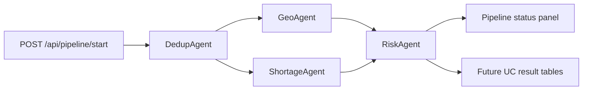

# Agent Specs and State

This folder contains the current Data Readiness Desk agents. They can run in-process through FastAPI or as Databricks multi-task Job tasks.

## Execution Graph



## Agent Contracts

| Agent | File | Inputs | Output | Current persistence |
| --- | --- | --- | --- | --- |
| DedupAgent | `dedup.py` | Facilities dataframe, optional `incoming_records` | Duplicate cluster decisions or ingest insert/update/duplicate/review decisions | Pipeline state JSON |
| GeoAgent | `geo.py` | Facilities dataframe, dedup context | Geographic quality flags, coverage gaps, geo score | Pipeline state JSON |
| ShortageAgent | `shortage.py` | Facilities dataframe, dedup context | Shortage areas and capability gaps | Pipeline state JSON |
| RiskAgent | `risk.py` | Dedup, Geo, and Shortage outputs | Risk matrix, executive summary, readiness scores | Pipeline state JSON |

## Pipeline State Shape

State is managed in `app/lib/pipeline_state.py`.

```json
{
  "pipeline_id": "abc123",
  "status": "pending|running|completed|failed",
  "mode": "local|databricks|ingest",
  "started_at": "ISO timestamp",
  "completed_at": "ISO timestamp",
  "context": {
    "incoming_records": []
  },
  "agents": {
    "dedup": {
      "name": "dedup",
      "status": "pending|running|completed|failed|skipped",
      "started_at": "ISO timestamp",
      "completed_at": "ISO timestamp",
      "result": {},
      "error": null
    },
    "geo": {},
    "shortage": {},
    "risk": {}
  }
}
```

## Runtime Modes

- `PIPELINE_MODE=local`: FastAPI starts an asyncio pipeline in the app process. State is written to `app/state/pipeline_{id}.json`.
- `PIPELINE_MODE=databricks`: FastAPI triggers a Databricks multi-task Job. Each task runs `app/jobs/run_agent.py <agent> <pipeline_id>`.

## Databricks Job Deployment State

The job definition is scaffolded by `scripts/setup_dbx_job.py`, but Databricks Job mode is not considered verified until:

1. `python scripts/setup_dbx_job.py` succeeds.
2. `.env` contains `DATABRICKS_PIPELINE_JOB_ID=<job id>`.
3. `app/app.yaml` or deployed app env sets `PIPELINE_MODE=databricks`.
4. `app/app.yaml` or deployed app env sets `DATABRICKS_PIPELINE_JOB_ID=<job id>`.
5. `POST /api/pipeline/start` completes a Databricks run and `GET /api/pipeline/status/{id}` shows all four agents completed.

Until then, deployed apps should keep `PIPELINE_MODE=local` so the pipeline remains clickable.

## Unity Catalog Persistence Gap

Current agent outputs stay in pipeline state JSON. The next persistence work is:

- DedupAgent -> `work.facility_duplicate_candidates`
- GeoAgent -> `work.data_quality_findings`
- ShortageAgent -> `result.geo_risk_recommendations`
- RiskAgent -> `result.readiness_kpi_snapshot` and `result.action_recommendations`
