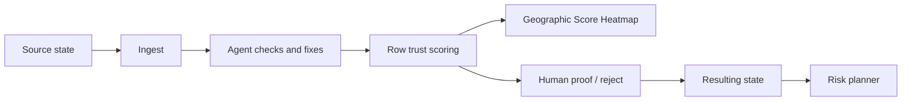
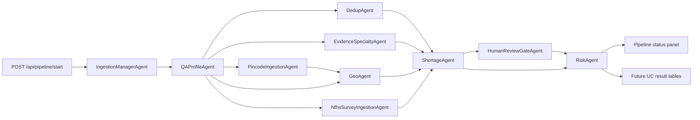
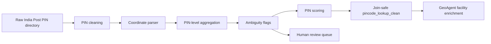
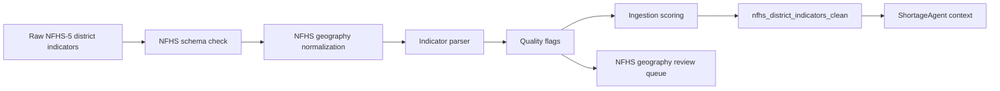

# Agent Specs and State

This folder contains the current Data Readiness Desk agents. They can run in-process through FastAPI or as Databricks multi-task Job tasks.

The architecture was refined in `docs/design-session-2026-06-15-agent-architecture.md`. The current skeleton treats ingestion as a manager/workflow, with QA/Profile, PIN Directory, NFHS Survey, Dedupe, Evidence/Specialty, Geo, Shortage, Human Review, and Risk stages.

The concrete data-quality workflow is now anchored by Sarah's forked agent docs:

- `docs/agent_workflow_pipeline_v2_lindsay_handoff.md`: Lindsay handoff for the v2 ten-agent trust-first pipeline, row_scorer_v2, geographic trust heatmap, demo language, and in-product labels.
- `agents/ingestion_agent.md`: orchestration prompt, alignment/cleaning sub-agent, dedupe sub-agent, review surface agent, and scoring agent.
- `docs/facilities_data_quality.md`: field-level cleaning rules, canonical state mapping, dedupe classes, geocoding strategy, and baseline quality findings.
- `agents/pincode_ingestion_agent.md`: PIN directory orchestrator and sub-agent prompts for safe postal geography enrichment.
- `docs/pincode_data_quality.md`: PIN directory baseline, confidence tiers, ambiguity rules, and join-safe facility enrichment rules.
- `agents/nfhs_survey_ingestion_agent.md`: NFHS-5 district survey ingestion orchestrator and sub-agent prompts.
- `docs/nfhs_survey_ingestion_data_quality.md`: NFHS suppression/caution handling, district join-key rules, and ingestion-quality guardrails.

These Markdown files are not side notes. They are the rulebook for the workflow below and should be treated as implementation source material for each agent.

## Demo Contract

The agent workflow exists to make the Track 4 story demoable in three minutes while producing the Track 2 side effect:

- Ingest new or updated facility data.
- Find quality, duplicate, evidence, and location problems automatically.
- Score facility rows into A/B/C/D uncertainty tiers that feed the Geographic Score Heatmap.
- Treat row scoring as a trust model: coherent, evidenced, geospatially plausible, non-duplicative, and safe to count in planning.
- Produce a proof/reject queue instead of asking users to clean rows manually.
- Commit approved fixes into the trusted resulting state.
- Generate risk-planning recommendations only from that resulting state.



## Execution Graph



## Agent Contracts

### Current Agents

| Agent | File | Inputs | Output | Current persistence |
| --- | --- | --- | --- | --- |
| IngestionManagerAgent | `ingestion.py` | Facilities dataframe, optional `incoming_records` | Upload/schema routing, field presence, column-shift suspicion | Pipeline state JSON |
| QAProfileAgent | `qa.py` | Facilities dataframe, ingestion context | Completeness scores, sparse fields, metadata flags | Pipeline state JSON |
| PincodeIngestionAgent | `pincode.py` | Facilities dataframe, QA context | PIN workflow contract validation, join-safe lookup guardrails, PIN review items | Pipeline state JSON |
| NfhsSurveyIngestionAgent | `nfhs.py` | Facilities dataframe, QA context | NFHS survey contract validation, normalized district join-key guardrails, survey caveats | Pipeline state JSON |
| DedupAgent | `dedup.py` | Facilities dataframe, optional `incoming_records` | Duplicate cluster decisions or ingest insert/update/duplicate/review decisions | Pipeline state JSON |
| EvidenceSpecialtyAgent | `evidence.py` | Facilities dataframe, QA context | Capability claims, evidence status, contradiction flags | Pipeline state JSON |
| GeoAgent | `geo.py` | Facilities dataframe, dedup context | Geographic quality flags, coverage gaps, geo score | Pipeline state JSON |
| ShortageAgent | `shortage.py` | Facilities dataframe, dedup context | Shortage areas and capability gaps | Pipeline state JSON |
| HumanReviewGateAgent | `review.py` | Dedup, Evidence, Geo, Shortage outputs | Review queue triggers and material planning impact score | Pipeline state JSON |
| RiskAgent | `risk.py` | Dedup, Evidence, Geo, Shortage, Review outputs | Risk matrix, executive summary, readiness scores | Pipeline state JSON |

### IngestionManagerAgent Operating Contract

Source rules: `agents/ingestion_agent.md` and `docs/facilities_data_quality.md`.

Responsibilities:

- Detect scraper corruption:
  - non-UUID `unique_id`
  - JSON arrays shifted into `name`
  - known bad `address_city = 'kie'`
  - empty facility names
- Apply the permanent exclusion list for records known to be unsafe.
- Normalize field types:
  - invalid `yearEstablished` -> null
  - invalid `numberDoctors` / `capacity` -> null
  - invalid array fields -> null
  - duplicate specialties within one row -> distinct specialties only
- Apply canonical state mapping from the facilities data-quality document.
- Route records:
  - `qa_ready` when the row has a usable schema and required fields
  - `needs_mapping_review` when columns, required fields, or shifted content are suspicious

Current code status: implemented as a lightweight route/field-presence detector. The full field cleaning and canonical state mapping are documented and queued for UC-backed implementation.

### QAProfileAgent Operating Contract

Source rules: `docs/facilities_data_quality.md#2-cleaning-rules-field-by-field`.

Responsibilities:

- Score field completeness by identity, location, capability, provenance, and metadata groups.
- Flag sparse groups that would materially reduce planning confidence.
- Detect suspicious metadata such as impossible years.
- Turn structural uncertainty into reviewable flags rather than silent cleanup.

Current code status: implemented for group-level completeness and suspicious year checks.

### DedupAgent Operating Contract

Source rules: `docs/facilities_data_quality.md#3-deduplication-rules`.

Dedup classes:

| Type | Detection | Workflow decision |
| --- | --- | --- |
| Type 1 | Exact row duplicate | keep one silently |
| Type 2 | Same name + same location, different `unique_id` | keep canonical/best located record |
| Type 3a | Matching record where incoming adds useful data | update existing record |
| Type 3b | Matching record where incoming removes data | flag for human review |
| Type 4 | Same name, different city | insert as distinct branch/site |
| Type 5 | Same name, same city, coordinates differ >1km | flag for human review |

Current code status: deterministic skeleton handles exact-name duplicate checks in ingest mode and duplicate clusters in analysis mode. The five-class contract above is the target behavior for the Databricks agent implementation.

### EvidenceSpecialtyAgent Operating Contract

Source rules: challenge prompt plus `docs/facilities_data_quality.md` array/specialty notes.

Responsibilities:

- Treat `specialties`, `procedure`, `equipment`, `capability`, and free-text `description` as evidence-bearing fields.
- Extract capability claims for ICU, maternity, emergency, oncology, trauma, NICU, dialysis, surgery, and other planning-critical needs.
- Classify each claim as strong evidence, partial evidence, weak/suspicious evidence, or no claim.
- Flag contradictions between structured specialties and free-text claims.
- Preserve evidence snippets for planner trust and review.

Current code status: skeleton evidence extraction exists and feeds review/risk. Full evidence snippets and contradiction persistence are still pending.

### GeoAgent Operating Contract

Source rules: `docs/facilities_data_quality.md#4-geocoding-strategy`, `agents/pincode_ingestion_agent.md`, and `docs/pincode_data_quality.md`.

Responsibilities:

- Validate coordinates against India bounds: latitude 8-37 N, longitude 68-98 E.
- Repair invalid/missing facility coordinates in this order:
  - accept valid existing coordinates
  - use **join-safe PIN-level lookup** from `pincode_lookup_clean`
  - use Nominatim with address/city/state/India
  - leave unresolved and log `coord_missing_unresolved`
- Flag mismatched state/city/PIN combinations.
- Surface data-poor regions separately from true shortage regions.
- Never join facilities directly to the raw post-office-grain PIN directory; that fans out facility rows.
- Use PIN confidence tiers:
  - Tier A: automatic state/district enrichment is acceptable.
  - Tier B: usable with a visible caveat.
  - Tier C: review or broad geography only.
  - Tier D: weak evidence only; never automatic assignment.
- Preserve PIN ambiguity fields on facility enrichment: `location_source`, `location_confidence`, `pincode_ambiguity_flags`, `post_office_count`, `state_count`, and `district_count`.

Current code status: skeleton location completeness and coverage-gap scan exists. PIN lookup tables, ambiguity joins, and Nominatim repair remain target implementation.

### PIN Directory Enrichment Workflow

Runtime agent: `PincodeIngestionAgent` in `app/lib/agents/pincode.py`.

Source rules: `agents/pincode_ingestion_agent.md` and `docs/pincode_data_quality.md`.

The India Post PIN directory is **post-office grain**, not PIN grain. A single PIN can map to many offices, districts, regions, and sometimes states. The app must preserve that distinction.

Target tables:

| Table | Grain | Purpose |
| --- | --- | --- |
| `pincode_post_offices_clean` | one row per post office | cleaned audit/reference layer |
| `pincode_lookup_clean` | one row per PIN | join-safe enrichment layer for facilities |
| `pincode_ambiguity_flags` | one row per ambiguity finding | planner/reviewer visibility |
| `pincode_review_queue` | review item | human review for unsafe PIN-derived assignments |
| `pincode_ingestion_log` | run summary | repeatable pipeline/audit history |

Required sub-agent flow:



Core rules:

- A PIN code is not a district key.
- Never fan out facility rows by joining facilities to the raw post-office table.
- Create one-row-per-PIN lookup rows with confidence, ambiguity flags, coordinate counts, and centroid quality.
- Multi-state PINs are unsafe for automatic state assignment.
- Multi-district PINs need ambiguity visibility; do not choose a district silently.
- PIN-derived coordinates are approximate postal centroids, not exact facility coordinates.

### NFHS Survey Ingestion Workflow

Runtime agent: `NfhsSurveyIngestionAgent` in `app/lib/agents/nfhs.py`.

Source rules: `agents/nfhs_survey_ingestion_agent.md` and `docs/nfhs_survey_ingestion_data_quality.md`.

The NFHS-5 district health indicators table is **district survey context**, not facility evidence and not a facility geocoder. It can help planners understand demand-side context after facility data is made trustworthy, but it must not be treated as proof that a facility exists or can provide a service.

Target tables:

| Table | Grain | Purpose |
| --- | --- | --- |
| `nfhs_district_indicators_clean` | one row per normalized NFHS district | cleaned survey indicators with caveat counts |
| `nfhs_indicator_quality_flags` | one row per indicator caveat | suppressed, caution, parse, range, and geography warnings |
| `nfhs_geography_review_queue` | review item | human review for unsafe district keys or geography drift |
| `nfhs_ingestion_log` | run summary | repeatable survey ingestion/audit history |

Required sub-agent flow:



Core rules:

- Suppressed `*` cells become null values with explicit suppression flags; never convert them to zero.
- Parenthesized estimates remain parsed values with caution flags; never hide sample-size caveats.
- NFHS ingestion quality is not health risk. Risk synthesis may cite survey context only after facility evidence is trusted.
- Normalize district join keys before any facility-to-survey context join.
- NFHS does not dedupe, geocode, or validate individual facilities.

### ShortageAgent Operating Contract

Source rules: Track 2 downstream planning requirements.

Responsibilities:

- Aggregate trust-weighted capability evidence by geography.
- Penalize sparse, contradictory, or unresolved facility records.
- Identify care-need gaps for emergency, ICU, maternity, NICU, oncology, trauma, dialysis, and surgery.
- Distinguish "likely care gap" from "data too poor to conclude."

Current code status: skeleton shortage scan exists and feeds RiskAgent.

### HumanReviewGateAgent Operating Contract

Source rules: `agents/ingestion_agent.md#5-sub-agent-c--review-surface-agent`.

Responsibilities:

- Route ambiguous duplicates, data removals, contradictory claims, and planning-critical location changes into a proof/reject queue.
- Attach owner, confidence, evidence, next step, and material planning impact.
- Require reviewer comments for decisions that change resulting state.
- Preserve audit history for Unity Catalog result tables.

Current code status: review queue generation exists. UC persistence and full decision audit tables are still pending.

### RiskAgent Operating Contract

Source rules: `agents/ingestion_agent.md#6-sub-agent-d--scoring-agent`.

Responsibilities:

- Refresh quality/readiness tiers after each pipeline run.
- Combine QA, dedupe, evidence, geo, shortage, and review signals into:
  - data readiness score
  - planning readiness score
  - priority risk matrix
  - top actions for data stewards and planners
- Surface tier-D records and name-specialty failures.
- Generate Track 2 planning recommendations only from resulting/trusted state.

Current code status: skeleton synthesis combines agent outputs into readiness scores and risks. Full tier scoring and UC views are target implementation.

## Pipeline State Shape

State is managed in `app/lib/pipeline_state.py`.

```json
{
  "pipeline_id": "abc123",
  "status": "pending|running|completed|failed",
  "mode": "local|databricks|ingest",
  "started_at": "ISO timestamp",
  "completed_at": "ISO timestamp",
  "context": {
    "incoming_records": []
  },
  "agents": {
    "ingestion": {"status": "completed", "result": {}},
    "qa": {},
    "pincode": {},
    "nfhs": {},
    "dedup": {},
    "evidence": {},
    "geo": {},
    "shortage": {},
    "review": {},
    "risk": {}
  }
}
```

## Runtime Modes

- `PIPELINE_MODE=local`: FastAPI starts an asyncio pipeline in the app process. State is written to `app/state/pipeline_{id}.json`.
- `PIPELINE_MODE=databricks`: FastAPI triggers a Databricks multi-task Job. Each task runs `app/jobs/run_agent.py <agent> <pipeline_id>`.

## Databricks Job Deployment State

The job definition is scaffolded by `scripts/setup_dbx_job.py`, but Databricks Job mode is not considered verified until:

1. `python scripts/setup_dbx_job.py` succeeds.
2. `.env` contains `DATABRICKS_PIPELINE_JOB_ID=<job id>`.
3. `app/app.yaml` or deployed app env sets `PIPELINE_MODE=databricks`.
4. `app/app.yaml` or deployed app env sets `DATABRICKS_PIPELINE_JOB_ID=<job id>`.
5. `POST /api/pipeline/start` completes a Databricks run and `GET /api/pipeline/status/{id}` shows all ten agents completed.

Until then, deployed apps should keep `PIPELINE_MODE=local` so the pipeline remains clickable.

Latest verification, 2026-06-16:

- Expected runnable agent/task count: 10 (`ingestion`, `qa`, `pincode`, `nfhs`, `dedup`, `evidence`, `geo`, `shortage`, `review`, `risk`).
- Databricks App `dbx-hack-doctors` exists, but app compute reported `STOPPED`.
- Databricks Job id `590750946177761` exists in local env/config, but a validation smoke run could not start because the workspace/account returned: `Triggering new runs for organization 7474647758171864 is currently disabled temporarily.`
- `app/app.yaml` currently sets `PIPELINE_MODE=local`, which is the right steady-state fallback for a clickable demo until Databricks Job mode can be revalidated.
- UI copy/badges should treat review counts as notifications/work queue items, not as agent counts or failed task counts.

## Unity Catalog Persistence Gap

Current agent outputs stay in pipeline state JSON. The next persistence work is:

- PincodeIngestionAgent -> `work.pincode_post_offices_clean`, `work.pincode_lookup_clean`, `work.pincode_ambiguity_flags`, `work.pincode_review_queue`, `audit.pincode_ingestion_log`
- NfhsSurveyIngestionAgent -> `work.nfhs_district_indicators_clean`, `work.nfhs_indicator_quality_flags`, `work.nfhs_geography_review_queue`, `audit.nfhs_ingestion_log`
- DedupAgent -> `work.facility_duplicate_candidates`
- EvidenceSpecialtyAgent -> `work.facility_capability_evidence`
- GeoAgent -> `work.data_quality_findings`
- ShortageAgent -> `result.geo_risk_recommendations`
- HumanReviewGateAgent -> `result.reviewer_notes` or `result.action_recommendations`
- RiskAgent -> `result.readiness_kpi_snapshot` and `result.action_recommendations`
