# Data Readiness Desk Demo Narrative

## One-Line Pitch

Data Readiness Desk turns messy healthcare facility records into a trusted planning state by letting Databricks agents do the first-pass cleanup and asking humans only to proof or reject material decisions.

## Track Framing

We are submitting for **Track 4: Data Readiness Desk**.

The downstream value is **Track 2: Medical Desert Planner**. We do not start by claiming where the care gaps are. We first ask whether the data is reliable enough to support that claim.

## The Problem

The source data has 10,000 healthcare facility records across India. It is useful, but it is not planning-ready:

- facility names can be duplicated or slightly varied
- location fields can be sparse or inconsistent
- claimed capabilities can appear only in uneven free text
- specialty fields can disagree with descriptions, equipment, or procedure claims
- some records are strong enough for automation, while others need human confirmation

A planner should not have to clean this manually, and the system should not pretend uncertain evidence is fact.

## The Product Promise

The app creates a repeatable workflow:

1. **Current State:** show the live dataset, readiness KPIs, data quality drivers, and clickable call-to-action badges.
2. **Import + Pipeline:** stage a new XLSX/CSV file and run the Databricks agent workflow.
3. **Actions:** produce an operational proof/reject queue with evidence, confidence, owner, next step, and decision notes.
4. **Risk Recommendations:** synthesize planning risks only from the trusted resulting state.

## Agent Workflow

The demo presents the workflow as an ingestion-led pipeline:

```mermaid
flowchart LR
  import[New file or source update] --> ingest[Ingestion Manager]
  ingest --> qa[QA Profile Agent]
  qa --> dedupe[Dedup Agent]
  dedupe --> evidence[Evidence Agent]
  evidence --> geo[Geo Filter Agent]
  geo --> shortage[Shortage Agent]
  shortage --> review[Human Review Gate]
  review --> risk[Risk Synthesis Agent]
```

The agents separate three classes of work:

- **safe auto-fixes:** normalize obvious fields, cluster clear duplicates, and standardize known values
- **human review:** contradictory claims, ambiguous duplicates, weak capability evidence, and planning-critical changes
- **risk synthesis:** care-gap recommendations that account for confidence and data quality

For geography, the app treats the India Post PIN directory as an assist layer, not ground truth. A PIN code is not a district key: the workflow creates a one-row-per-PIN lookup with confidence tiers and ambiguity flags before facilities use it for enrichment.

## Why This Matters

Without the trust layer, a planner may over-count duplicate facilities, trust weak capability claims, or confuse data-poor regions with true medical deserts.

With the trust layer, the planner sees:

- what can be counted
- what needs review
- what evidence supports each recommendation
- where the risk is real versus where the data is too weak to conclude

## Demo Arc

1. Open the deployed Databricks App on **Current State**.
2. Confirm the app is live against Unity Catalog and loaded around 10,000 records.
3. Point to clickable top-level notification badges and KPI cards.
4. Open **Import + Pipeline** and upload `demo/data_readiness_demo_import.xlsx`.
5. Run the analysis and show all agent stages completing.
6. Open **Actions** and show the proof/reject queue.
7. Select an action, read its evidence, add a decision note, and route it.
8. Open **Risk Recommendations** and show how planning risk is generated from the resulting state.

## Closing Line

This is the core value: humans do not clean messy healthcare data row by row. Agents surface the problems, humans confirm the risky calls, and the resulting trusted state becomes the planning layer.
