# Timesharerer Doctors

## Inspiration

Healthcare planning breaks down when the underlying facility data cannot be trusted. The hackathon dataset has 10,000 messy healthcare facility records across India: duplicate facilities, sparse locations, uneven specialties, free-text capability claims, suspicious metadata, and records that may look useful but are risky to count.

We were inspired by a simple planning question: before an NGO coordinator or healthcare analyst can decide where care gaps exist, how do they know which facility records are trustworthy enough to use?

That led us to build for **Track 4: Data Readiness Desk**, with **Track 2: Medical Desert Planner** as the downstream outcome. Our thesis is that medical desert planning is a side effect of trustworthy data readiness. First clean, score, and review the facility evidence; then use the resulting trusted state to reason about risk.

## What it does

Timesharerer Doctors is a Databricks App that helps a non-technical planner turn messy healthcare facility data into an action queue and a risk-planning view.

The app opens on the current dataset state: live source catalog, facility counts, data consistency, duplicate pressure, human-review volume, and readiness drivers. From there, users can import a new XLS/XLSX/CSV file, run an agent-led pipeline, and see what the system found.

The pipeline produces two outputs:

- **Recommendations / Actions:** a proof/reject queue for data stewards, including duplicate clusters, missing locations, weak capability evidence, suspicious claims, and records that need human confirmation.
- **Risk Recommendations:** downstream planning signals that highlight where care gaps may be real, where confidence is low, and where bad data could be creating false certainty.

The workflow is built around honest uncertainty. The app does not pretend a weak NICU, ICU, emergency, maternity, oncology, trauma, or dialysis claim is automatically true. It surfaces the evidence, confidence, owner, and next step so the planner can approve, reject, or request more evidence.

## How we built it

We built the app as a Databricks App with a React/Vite frontend and a FastAPI backend.

The data architecture separates three states:

- **Source state:** the original Unity Catalog facilities table.
- **Work state:** imported records, agent outputs, review queues, and scratchpad notes.
- **Resulting state:** trusted, reviewed data that powers actions and risk recommendations.

The agent workflow is ingestion-led:

```mermaid
flowchart LR
  import[Import or source update] --> ingest[Ingestion Manager]
  ingest --> qa[QA Profile Agent]
  qa --> dedupe[Dedup Agent]
  dedupe --> evidence[Evidence Agent]
  evidence --> geo[Geo Filter Agent]
  geo --> shortage[Shortage Agent]
  shortage --> review[Human Review Gate]
  review --> risk[Risk Synthesis Agent]
```

We merged detailed workflow specs into the project so the agents have real operating rules, not just generic labels:

- `agents/ingestion_agent.md` defines the ingestion orchestrator, cleaning sub-agent, dedupe sub-agent, review surface, and scoring agent.
- `docs/facilities_data_quality.md` defines concrete rules for scraper corruption, field typing, canonical Indian state mapping, dedupe classes, geocoding, and quality scoring.
- `agents/pincode_ingestion_agent.md` and `docs/pincode_data_quality.md` define safe PIN-directory enrichment, including the rule that facilities only join to one-row-per-PIN lookup data.
- `agents/nfhs_survey_ingestion_agent.md` and `docs/nfhs_survey_ingestion_data_quality.md` define NFHS-5 district survey context, including suppression/caution flags and normalized district join keys.
- `app/lib/agents/SPEC.md` maps those rules into the current ten-agent app workflow.

The app also includes a Markdown scratchpad for planner notes and tags. Those notes can steer the next parse, so the human review context becomes part of the workflow instead of being trapped in a side document.

## Challenges we ran into

The biggest challenge was making the app reliable inside Databricks Apps while still being rich enough for a demo.

Locally, everything worked quickly. In the deployed Databricks App, the initial `/api/state` call sometimes hung or fell back to a tiny local demo dataset. We traced that to Databricks SQL connector behavior: cloud fetch was trying to retrieve result chunks from cloud storage URLs that the app runtime could not reach. The fix was to disable SQL cloud fetch, prewarm an in-memory app state cache, increase load timeouts, and prevent silent fallback from masquerading as live data.

We also had to keep the UX honest. It was tempting to show clean-looking numbers, but the real product value is exposing what is uncertain. That led us to make the top-level KPI cards and tab badges clickable, split import/pipeline work from the actions queue, and make every recommendation actionable with status, owner, confidence, evidence, and notes.

Another challenge was balancing automation with human review. Some issues are safe for agents to fix automatically. Others, like ambiguous duplicate clusters or capability claims that change planning outcomes, must be routed to a human proof/reject queue.

## Accomplishments that we're proud of

We are proud that the app tells a complete Track 4 to Track 2 story:

- It loads the real Unity Catalog dataset in Databricks mode.
- It supports XLS/XLSX/CSV import preview.
- It runs a ten-agent workflow across facility readiness, PIN geography context, NFHS survey context, and risk synthesis.
- It surfaces duplicate, location, evidence, shortage, and review-gate signals.
- It gives users an actionable proof/reject queue instead of a passive report.
- It turns the trusted resulting state into medical desert risk recommendations.

We are especially proud of the architecture split between source state and resulting state. That makes the product feel like a real data readiness tool, not just a dashboard over raw records.

We also created a demo workbook with intentional duplicates, sparse fields, weak claims, and suspicious metadata so the whole workflow can be demonstrated end to end in three minutes.

## What we learned

We learned that healthcare data readiness is not just about cleaning rows. It is about preserving evidence, communicating uncertainty, and making sure the planning surface does not overstate confidence.

We also learned that "agentic" workflows need explicit contracts. The agents became much more meaningful once we documented their rules: what counts as scraper corruption, how dedupe decisions should be classified, how geocoding should be repaired, when humans should intervene, and how scoring should flow into planning risk.

On the Databricks side, we learned that deployment details matter. A dashboard that works locally is not enough; the app needs hot cache behavior, strict source-state rules, diagnostic endpoints, and clear failure modes so a planner never confuses fallback data with the real dataset.

## What's next for Timesharerer Doctors

Next, we want to persist every agent output and human decision into Unity Catalog work/result/audit tables. That would turn the current clickable workflow into a fully versioned data readiness system.

We also want to deepen the agents:

- implement the full canonical state mapping
- add PIN-code and Nominatim geocoding repair
- implement NFHS district survey clean/flag/review tables
- persist duplicate clusters and merge decisions
- extract evidence snippets from free-text descriptions
- score capability claims by trust level
- connect risk recommendations directly to reviewed resulting-state tables

Longer term, Timesharerer Doctors could become a planning cockpit for NGOs and public-health teams: import messy facility data, let agents find the problems, let humans confirm the material decisions, and continuously produce trustworthy care-gap recommendations.
