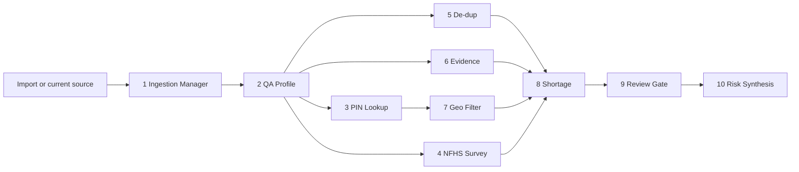

# Timesharerer Doctors

## Inspiration

Healthcare planners cannot make good decisions from data they do not trust.

The hackathon dataset gave us more than 10,000 healthcare facility records across India, but the data was not planning-ready. Facility names repeat under slightly different forms. Locations are sparse or inconsistent. PIN codes can be ambiguous. Clinical capabilities may appear only in free text. Specialty fields can disagree with descriptions. A dashboard over that raw data would look useful, but it could easily over-count facilities, trust weak claims, or mistake missing data for a true care gap.

That shaped our core idea: **medical desert planning should be downstream of data readiness**.

We built Timesharerer Doctors for **Track 4: Data Readiness Desk**, with **Track 2: Medical Desert Planner** as the outcome. Before the app says where care is missing, it asks which records are trustworthy enough to count.

## What it does

Timesharerer Doctors is a Databricks App that turns messy healthcare facility records into a trusted planning workflow.

The app has four main surfaces:

- **Current State:** shows the current dataset, live/source status, facility counts, readiness scores, duplicate pressure, sparse locations, and review volume.
- **Import + Pipeline:** lets a user drag in an XLS, XLSX, or CSV file, preview import readiness, write scratchpad notes, and run the agent pipeline.
- **Actions:** turns agent findings into an operational proof/reject queue with issue type, owner, confidence, evidence, next step, status, and reviewer notes.
- **Risk Recommendations:** shows downstream planning risks after the data has been scored, deduped, enriched, and routed through review.

The product is designed around honest uncertainty. It does not silently convert a weak NICU, ICU, emergency, maternity, oncology, trauma, or dialysis claim into planning truth. Instead, it asks: what is the evidence, how confident are we, who owns the decision, and what should happen next?

## How we built it

We built the app as a Databricks App with:

- React and Vite for the frontend
- FastAPI for the backend
- Unity Catalog as the intended source/result/audit layer
- local/offline mode for development and demo resilience
- a deterministic ten-agent pipeline that can run without LLM calls for repeatable judging demos

The app separates the workflow into three states:

- **Source state:** immutable source records, usually the Unity Catalog facilities table.
- **Work state:** uploads, agent outputs, scratchpad notes, and review queues.
- **Resulting state:** trusted, reviewed data that powers actions and risk recommendations.

The current pipeline runs ten stages:

We grounded the agents in concrete operating rules from project docs:

- ingestion and review workflow specs in `agents/ingestion_agent.md`
- facility cleaning, dedupe, geocoding, and scoring rules in `docs/facilities_data_quality.md`
- PIN-code enrichment rules in `agents/pincode_ingestion_agent.md` and `docs/pincode_data_quality.md`
- NFHS-5 district survey context rules in `agents/nfhs_survey_ingestion_agent.md` and `docs/nfhs_survey_ingestion_data_quality.md`
- integrated runtime contracts in `app/lib/agents/SPEC.md`

We also built a demo import workbook, `demo/data_readiness_demo_import.xlsx`, with intentional duplicates, sparse locations, weak claims, and suspicious metadata so the full workflow can be shown in three minutes.

## Challenges we ran into

The hardest product challenge was keeping the app honest. A clean-looking dashboard is easy to make; a trustworthy readiness workflow is harder. We had to design the UI so uncertain records became review work instead of disappearing behind a score.

The hardest platform challenge was making the app behave reliably across local development and Databricks Apps. Locally, the app could read checked-in CSV data and run the pipeline quickly. In Databricks, we needed to handle Unity Catalog access, SQL warehouse behavior, app startup latency, and cases where Databricks compute or job runs were unavailable.

One concrete issue was Databricks SQL cloud fetch. The app runtime could fail when result chunks were fetched from cloud storage URLs, so we disabled cloud fetch, added a state cache, added diagnostics, and made fallback behavior explicit. We also added `./run.sh dev local` so the UI and local deterministic agents remain testable while Databricks credits or workspace jobs are unavailable.

Another challenge was scope. We wanted to show import, profiling, dedupe, evidence, geography, human review, and planning risk without turning the demo into a maze. The four-tab structure kept the story tight: current state, import/pipeline, actions, risk.

## Accomplishments that we're proud of

We are proud that Timesharerer Doctors tells a complete Track 4 to Track 2 story:

- It starts with messy facility data and makes the quality problems visible.
- It supports XLS/XLSX/CSV import preview.
- It runs a ten-stage readiness pipeline.
- It treats PIN-code and NFHS survey context carefully instead of using them as blunt joins.
- It turns agent findings into an actionable proof/reject queue.
- It records reviewer decisions and notes as part of the workflow.
- It links risk recommendations back to cleanup work, so planning output stays tied to evidence.

We are especially proud of the human-in-the-loop design. The agents do the first pass, but the app reserves planning-critical calls for proof/reject review. That is the difference between "AI cleaned my spreadsheet" and "my planning dataset is becoming trustworthy."

## What we learned

We learned that data readiness is not just a data-cleaning problem. It is an evidence and trust problem.

A facility record can be complete but duplicated. A location can have a PIN code but still be ambiguous. A description can claim a critical service without enough support to plan around it. A medical desert recommendation can be wrong if the system is really seeing sparse data instead of sparse care.

We also learned that agent workflows need contracts. The useful work came from spelling out the rules: what counts as scraper corruption, when a duplicate is safe to merge, when PIN enrichment is too ambiguous, which NFHS values need caution flags, and which recommendations require a human decision.

On the engineering side, we learned to build for graceful degradation. A hackathon demo should still be inspectable when cloud jobs are paused, credits run out, or a workspace is cold. The local mode became part of the product discipline: the same workflow can be tested offline, while Databricks mode remains the target for source/result/audit persistence.

## What's next for Timesharerer Doctors

Next, we want to turn the current workflow into a fully persisted readiness system:

- persist every agent output, recommendation, decision, and audit event into Unity Catalog work/result/audit tables
- deepen duplicate clustering beyond exact-name matches
- implement richer capability-evidence extraction from descriptions
- complete canonical state/district normalization
- add PIN-code and geocoding repair with confidence tiers
- materialize NFHS clean/flag/review tables
- score care-gap recommendations directly from reviewed resulting-state tables
- support reusable dataset packs so NGOs can bring other healthcare facility datasets, not just the India DAIS dataset

The long-term vision is a planning cockpit for public-health teams: import messy facility data, let agents find the problems, let humans confirm the material calls, and continuously produce trustworthy care-gap recommendations.
