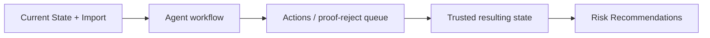

# Demo Review: Current State, Import, Actions, and Risk Flow

Date: 2026-06-15

Source: user-provided transcript excerpt in Codex attachment.

## Session Purpose

Review the current Databricks Hackathon app demo and refine what should be shown during a short, judge-facing walkthrough.

The conversation focused on:

- Which tabs should exist.
- Where import belongs.
- What the current dataset tab needs to communicate.
- How actions should support human proof/reject decisions.
- How Track 4 data readiness should flow into Track 2 risk recommendations.
- Why the demo import file should light up the agent pipeline.

## Main Decisions

### 1. Track Mapping

The app story remains:

- **Current State / Dataset**: shows the source dataset, scratchpad, current numbers, preview, and import.
- **Actions**: solves **Track 4: Data Readiness Desk** by showing what is broken and what should be fixed.
- **Risk Recommendations**: supports **Track 2: Medical Desert Planner** as the downstream planning output.

### 2. Import Belongs With Current State

The transcript explicitly calls out that **Import should live with the current dataset**, not inside Actions.

Reasoning:

- Import is part of understanding or updating the current source state.
- Actions are the list of what the system found broken.
- Actions should not feel like a generic upload utility; they should feel like a prioritized call to action.

Target tab model:

1. `Current State`
2. `Actions`
3. `Risk Recommendations`

The current app still has `Import + Actions`, so this is now a UX follow-up item.

### 3. Scratchpad Feeds Re-Parsing

The scratchpad remains part of the current dataset workflow.

The intended behavior:

- Planner adds notes, tags, or known data caveats.
- Example: geolocation is unreliable for a source, or postcode should be preferred over coordinates.
- User triggers re-parse.
- Scratchpad context feeds into the agent pipeline and changes the resulting state.

### 4. Current Numbers Need Product Input

The transcript flags that the top-level readiness numbers need careful definition.

Questions to answer:

- What is broken in the current dataset?
- Which current metrics are most useful to a non-technical planner?
- Should current numbers be data-quality only, planning-risk oriented, or both?

Decision direction:

- Use an overall dataset confidence/readiness score.
- Use row-level confidence as the main MVP accounting unit.
- Field-level confidence can be a later enhancement only where it supports Track 2 planning decisions.

### 5. Actions Need Review State, Comments, and Ownership

Actions should be more than a static list.

Each action should support:

- `ready` / `auto-fix ready` state for obvious fixes.
- `needs human review` state for ambiguous or planning-impacting changes.
- Confidence.
- Owner or reviewer.
- Comments.
- Accept/reject decision.
- Reason for decision.

Example human notes:

- "I called the facility."
- "I am Dr. So-and-so and I work there."
- "This source is more reliable than the scraped page."

The team leaned toward free text rather than over-modeling the comment workflow for the demo.

### 6. Row-Level Confidence Is MVP

The transcript debated field-level confidence.

Decision direction:

- MVP should focus on row-level confidence/readiness.
- Row-level confidence answers whether a facility is trusted enough to count in planning.
- Field-level confidence can exist later for high-value fields such as geocode, PIN code, clinical capability, and provenance.

The key planning question:

> Are we confident enough in this facility row to send someone there or count it in coverage?

### 7. Demo Should Show Import Lighting Up Agents

The strongest demo move is not just explaining the architecture. It is uploading a small XLS/CSV and showing the agent workflow activate.

Desired demo import behavior:

- Token rows, around 10 records.
- Slight variations from the real data.
- Every agent should find something relevant.
- Pipeline status should visibly move through the agent workflow.
- Output should produce a proof/reject action list.
- Risk view should show the downstream effect.

This directly led to the repository demo workbook:

- `demo/data_readiness_demo_import.xlsx`
- `scripts/create_demo_import.py`

## Demo Beat Notes

1. Open the current state.
2. Show overall dataset confidence/readiness.
3. Show scratchpad and explain it feeds re-parsing.
4. Show dataset preview with search/filter/sort.
5. Upload the demo XLSX from the current state workflow.
6. Trigger the agent pipeline.
7. Watch ingestion, QA, dedupe, evidence, geo, shortage, review, and risk complete.
8. Move to Actions and show what needs proof/reject.
9. Add or reference a comment on an action.
10. Move to Risk Recommendations and show Track 2 as the outcome of Track 4 cleanup.

## Open Follow-Ups

- Rename `Current Dataset` to `Current State` or keep `Current Dataset` for clarity?
- Split the current `Import + Actions` tab into separate `Current State` import controls and a dedicated `Actions` tab.
- Define the top-level dataset readiness/confidence metric with Lindsay/product input.
- Decide which action statuses are required for demo: `auto_fix_ready`, `needs_review`, `accepted`, `rejected`, `commented`.
- Add CSV export/download for dataset preview if time allows.
- Decide which fields deserve field-level confidence after the MVP.
