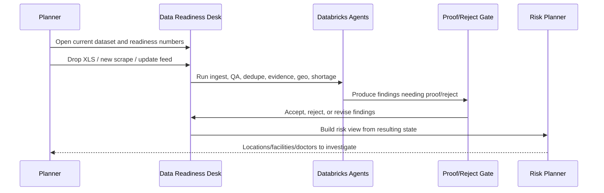
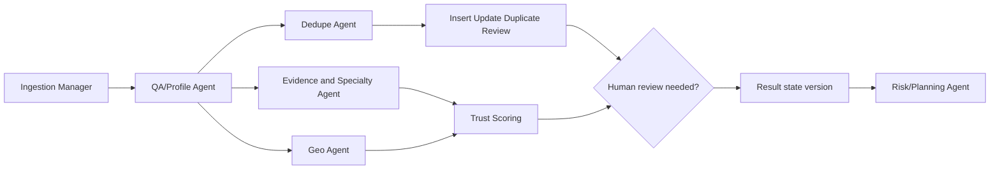

# Design Session: Agent-Led Data Readiness and Medical Desert Planning

Date: 2026-06-15

Source: user-provided transcript excerpt.

## Session Purpose

Review the proposed Databricks Data Readiness Desk architecture and align it with the observed dataset failure modes, the hackathon track strategy, and the agent workflow needed for a credible demo.

Primary submission track:

- Track 4: Data Readiness Desk

Downstream value story:

- Track 2: Medical Desert Planner

## Core Framing

The app should make scraped healthcare facility data planning-ready. The medical desert planning output is a downstream side effect of the readiness work.

The team framed the posture as:

- Primary story: make the dataset trustworthy enough for planning.
- Downstream story: cleaned, trust-weighted records support medical desert gap planning.
- Product principle: this is a trust layer, not only a cleansing layer.

## Top-Level Setting Added After Review

The submission should be presented as **Track 4 with Track 2 in mind**.

The short demo story:

- Data is messy, scraped, and not planning-ready.
- No human should manually clean the full dataset.
- Databricks agents run the ingestion and readiness workflow on behalf of the planner.
- The user only proofs or rejects material findings, especially items that change planning outcomes.
- The system maintains a source state and a resulting trusted state.
- Recommendations and risks are generated only from the resulting state.
- The risk planner is the Track 2 side effect of the Track 4 readiness workflow.

The app should help a non-technical planner answer:

- Can this facility really provide a claimed service?
- Which districts or PIN codes appear to lack coverage?
- Which records are safe enough to count in a planning scenario?
- Which records must be reviewed before they influence resource allocation?

## Dataset Failure Modes Discussed

The transcript calls out predictable data-quality problems:

- Nulls and sparsity in important fields such as doctors, capacity, and year established.
- Mostly present but imperfect postcodes.
- Duplicates and near-duplicates.
- Mismatches between structured fields and free-text descriptions.
- Claims that are weakly supported or not evidenced.
- Geospatial imprecision, including latitude/longitude or postcode inconsistencies.
- Ambiguous specialty mapping between controlled specialties and inferred specialties from text.
- Stale, suspicious, impossible, or inconsistent metadata.
- Source URL quality variation: broken, generic, duplicated, or weak corroborating URLs.
- Potential column shifts or field alignment problems during ingestion.

## Workflow Requirements

The workflow should separate:

1. Clear-cut automated fixes.
2. Ambiguous cases for human review.
3. Confidence-scored outputs for downstream planning.

Human-in-the-loop review is required for:

- Ambiguous duplicate decisions.
- Contradictory facility capability claims.
- Uncertain specialty mapping.
- Borderline geocodes.
- Large changes to specialties or other clinically meaningful attributes.
- Facilities whose trust-score change materially affects planning/resource allocation.

Every record or materialized entity should carry:

- Quality status.
- Claim/evidence status.
- Confidence score.
- Review status.
- Notes and override history.
- Version history for material changes.

## Agent Architecture Direction

The team discussed moving from a flat list of agents to an ingestion-led workflow with sub-tools/agents. The emerging architecture is:

## Proposed Agent Roles

### Ingestion Manager

Owns new file/drop processing and routes records through QA, dedupe, update/insert decisions, and human review gates.

Responsibilities:

- Accept uploaded XLS/XLSX/CSV rows.
- Detect gross column/schema alignment issues.
- Route clean enough records into QA.
- Route suspect files or shifted columns to human review.
- Decide when downstream agents can run.

### QA/Profile Agent

Finds "where the problems are."

Responsibilities:

- Scan schema and field completeness.
- Detect missing values and sparse fields.
- Detect suspicious or impossible metadata.
- Flag record-level QA tags.
- Detect likely column shifts or field misalignment.
- Produce field completeness summaries and anomaly flags.

### Dedupe Agent

May be a sub-agent/tool under ingestion, but should remain explicit because dedupe changes planning counts.

Responsibilities:

- Detect exact and fuzzy duplicate candidates.
- Decide merge/split/review for duplicate clusters.
- In ingest mode, decide insert/update/duplicate/review for incoming records.
- Trigger human review when updates conflict strongly with existing records.

### Evidence and Specialty Agent

The transcript emphasized that the system must cite underlying facility text and communicate uncertainty honestly. This agent is the bridge between raw claims and trusted planning evidence.

Responsibilities:

- Extract claimed capabilities from free text and structured fields.
- Normalize specialty labels.
- Compare structured specialties against inferred specialties.
- Flag contradictions and weakly evidenced claims.
- Produce claim evidence status: strong, partial, weak, suspicious, none.

### Geo Agent

Responsibilities:

- Validate geospatial and postcode consistency.
- Flag borderline geocodes.
- Aggregate facility confidence by geography.
- Produce geolocated specialty coverage inputs.

### Risk/Planning Agent

Responsibilities:

- Combine readiness, dedupe, evidence, and geo outputs.
- Produce trust-weighted region-level planning recommendations.
- Separate likely medical deserts from data-poor regions.
- Explain which records and claims materially influence a planning outcome.

## UI/UX Implications

The app should expose enough agent reasoning to be trusted, but not turn the planner UI into an engineering console.

Expose to users:

- Quality status.
- Claim/evidence status.
- Confidence.
- Why a record is in the review queue.
- Human review decisions and notes.
- Planning impact of a risky record.

Keep mostly internal:

- Low-level prompt details.
- Agent implementation boundaries, unless helpful for status/progress.
- Background cleanup steps that do not affect review decisions.

## Architecture Decisions Captured

- Track 4 remains the primary submission.
- Track 2 is the downstream outcome.
- The system needs a trust layer, not only a cleanup layer.
- Ingestion should be modeled as a manager/workflow, not just a file upload.
- QA and dedupe are related, but dedupe deserves explicit representation because duplicate counts affect planning.
- Human review should be triggered by large semantic changes, not only low confidence.
- The planning view must be trust-weighted and uncertainty-aware.
- Notes, overrides, and version history are required for credibility.

## Decisions Since This Session

- The current skeleton exposes eight runnable stages: `ingestion`, `qa`, `dedup`, `evidence`, `geo`, `shortage`, `review`, and `risk`.
- `QA/Profile Agent` is a separate runnable stage so its findings can be shown and persisted independently.
- `Evidence and Specialty Agent` is part of the current skeleton because claim evidence is central to honest planning risk.
- Risk recommendations are conceptually downstream of the resulting state, not raw source rows.

## Open Clarification Questions

1. What threshold should force human review for "material planning impact"?
2. What exact statuses do we want on each record: `trusted`, `needs_review`, `auto_fix_ready`, `rejected`, `planning_excluded`, or something else?
3. Should auto-fixes ever update the result state without approval, or should all auto-fixes be staged for batch approval?
4. Should the risk/planning output count only `strong` and `partial` evidence, or should weak evidence count with a penalty?
5. Should source URL quality become part of provenance scoring in the MVP?
6. Should the ingestion decision vocabulary stay `insert/update/duplicate/review`, or do we also need `reject` and `quarantine`?
