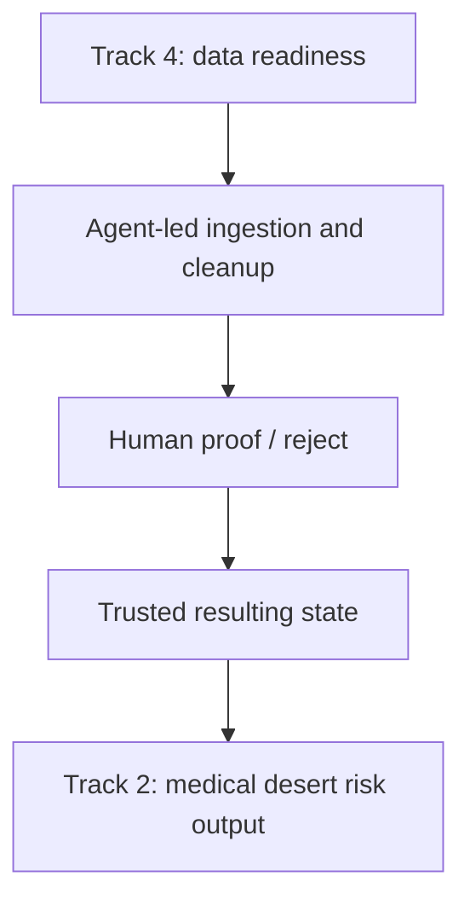
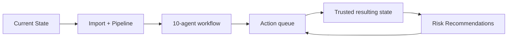
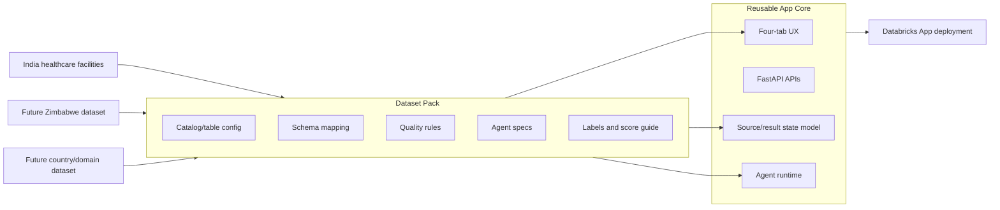
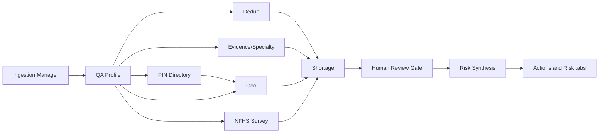

# Project Plan: Databricks Hackathon — Data Readiness Desk with Planning-Ready Outputs

## Reasoning

### 1. Best track fit: start with Track 4, but design for Track 2 downstream

Your team's stated approach is fundamentally a data readiness and trust layer: clean messy facility records, triage uncertainty, and produce geolocated specialty coverage with confidence.

That maps most directly to Track 4: Data Readiness Desk because the app needs to surface data issues, contradictions, sparse fields, and review queues.

At the same time, your output should explicitly enable medical desert and risk gap planning later, which aligns with Track 2.

So the right hackathon posture is:

- Primary submission story: "We make the dataset planning-ready."
- Downstream value story: "Those cleaned, trust-weighted records can drive medical desert gap planning."
- Demo posture: "No human should clean this manually. Agents find the problems and propose changes; humans proof/reject material decisions; the risk planner emerges from the trusted resulting state."



For a three-minute demo, show the full arc quickly: Geographic Score Heatmap first, Mission Control plus Row Uncertainty Distribution, import/stage new messy data, run the Databricks agent workflow, review the proof/reject queue, then open the risk planner and show how cleanup changes planning confidence.

### 2. The dataset is noisy in predictable ways, so the pipeline should be structured around those failure modes

The provided data has several known quality issues:

- Nulls and sparsity in important fields:
  - `numberDoctors`, `capacity`, and `yearEstablished` are often missing.
  - `postcode` is present for nearly all but not all records.
- Duplicates and near-duplicates:
  - Facilities may appear multiple times with slight name or address variations.
- Mismatches between structured fields and free text:
  - For example, specialties say one thing, while description or equipment fields say another.
- Claims that are unevidenced or weakly supported:
  - ICU, maternity, emergency, oncology, trauma, NICU, dialysis, and similar claims need evidence.
- Noisy, repetitive, uneven free-text evidence:
  - Description, capability, procedure, and equipment fields are claims, not truth.
- Geospatial imprecision:
  - Latitude/longitude may be off, and postcode may be missing or inconsistent.
- Ambiguous specialty mapping:
  - Controlled specialties and inferred specialties from text may disagree.
- Stale or suspicious metadata:
  - `yearEstablished` may be missing, impossible, or inconsistent with other signals.
- Source URL quality variation:
  - Some URLs will corroborate records, while others may be broken, generic, or duplicated.

These issues require a workflow that separates:

- Clear-cut automated fixes.
- Ambiguous cases for human review.
- Confidence-scored outputs for downstream planning.

### 3. Automation should handle certain cleanup, while humans handle borderline cases

The team approach from your transcript summary is the right pattern.

Agents first for:

- Primary QA.
- Standardization.
- Deduplication.
- Evidence extraction.
- Confidence scoring.

Humans second for:

- Ambiguous duplicates.
- Contradictory claims.
- Uncertain specialty mapping.
- Borderline geocodes.
- Facilities whose trust score materially changes planning outcomes.

This is important because the hackathon prompt explicitly says the app should:

- Cite underlying facility text.
- Communicate uncertainty honestly.
- Let users save or revise work.

That means the system should never pretend uncertain evidence is fact.

### 4. The app needs a trust layer, not just a cleaning layer

A non-technical planner needs answers like:

- "Can this facility really do emergency care?"
- "Which districts look like they have no maternity coverage?"
- "Which records are safe enough to count in a planning scenario?"

To support that, every record and every region should get:

- A quality status.
- A claim/evidence status.
- A confidence score.
- A review status.
- An audit trail of notes and overrides.

This creates trustworthy decision support rather than just a cleaned CSV.

The v2 Lindsay handoff sharpens this as a trust-first scoring model: `row_scorer_v2` asks whether each row is coherent, evidenced, geospatially plausible, non-duplicative, and safe to count in planning. That language should drive the demo, the heatmap, and the agent review gate.

### 5. Geolocated specialty coverage is the key downstream bridge to medical desert planning

Your stated output should be:

- Cleaned facility records.
- Normalized specialties and capabilities.
- Geolocation-aware coverage estimates.
- Confidence levels on those estimates.

That enables a planner to answer:

- Where real coverage exists.
- Where gaps are likely real.
- Where the problem may simply be data sparsity.

So the pipeline should distinguish:

- Care desert.
- Data desert.
- Uncertain desert.

### 6. Databricks should be the center of gravity for speed and reproducibility

To move quickly in one day:

- Use Databricks notebooks for profiling and QA.
- Use Delta tables for intermediate outputs.
- Use a simple Databricks App for the review interface.
- Keep deliverables in the Git repo for easy submission and versioning.

This keeps exploration, transformation, and app building in one place and reduces integration risk.

### 7. Minimum viable product should prioritize one tight workflow

Because of time, the MVP should focus on:

- EDA and quality assessment.
- Agent-driven cleanup and triage.
- Review queue with notes and overrides.
- Trust-weighted coverage output.
- Region-level planning view.

Anything beyond that should be treated as stretch.

## Current Product Shape

As of the latest 2026-06-15 build, the app is a Databricks App with a FastAPI backend and React/Vite frontend. The working product surface is four tabs:

- **Current State**: heatmap-first landing view with row uncertainty plotted geographically, Mission Control KPIs, row uncertainty distribution, scratchpad-derived tags, and a searchable/sortable dataset preview.
- **Import + Pipeline**: XLS/XLSX/CSV upload preview, Markdown scratchpad View/Edit flow, re-parse trigger, and the ten-agent pipeline status panel.
- **Actions**: actionable proof/reject work queue with clickable lanes, selected-action next steps, decision notes, and status-aware controls such as approve merge, apply safe fix, reject claim, and needs more evidence.
- **Risk Recommendations**: Track 2 planning output with evidence-attached risk rows, planning notes, and handoff buttons back into cleanup actions/evidence review.



Key UX decisions:

- Geographic Score Heatmap appears above Mission Control so planners see the geography of trust before the roll-up summary.
- Row Uncertainty Distribution replaces the old generic recommended queue card beside Mission Control.
- KPI cards are not passive; they navigate into filtered actions.
- Import and pipeline execution are separate from the Actions tab.
- Actions are a queue, not just a recommendation table.
- Risk recommendations must link back to cleanup work because planning risk is only credible when the underlying data issues are resolved.
- Dataset preview is explicitly a sample and labels how many preview rows are shown out of the loaded source record count.
- Readiness flags are visual chips: red for missing/sparse fields, gray for cluster/duplicate signals, and blue-gray for neutral/ok flags.

## Current Databricks Runtime Posture

The Databricks App should default to Unity Catalog for both source and resulting state:

```text
APP_DATA_MODE=unity_catalog
APP_SOURCE_MODE=unity_catalog
APP_STATE_MODE=unity_catalog
APP_SOURCE_CATALOG=databricks_virtue_foundation_dataset_dais_2026
APP_SOURCE_SCHEMA=virtue_foundation_dataset
APP_SOURCE_TABLE=facilities
APP_RESULT_CATALOG=dais_readiness_desk
APP_SOURCE_ROW_LIMIT=10000
APP_STATE_LOAD_TIMEOUT_SECONDS=45
APP_STATE_CACHE_PREWARM=true
APP_STATE_FALLBACK_ON_ERROR=false
DATABRICKS_SQL_USE_CLOUD_FETCH=false
```

Important lesson from deployment debugging: Databricks SQL connector cloud fetch can try to download result chunks from cloud storage URLs such as `us-west-2.storage.cloud.databricks.com`. In the Databricks App runtime this failed with connection refused, causing `/api/state` to fall back to a tiny 3-row demo dataset. The fix is to run the SQL connector with `use_cloud_fetch=false` and disable silent DBX fallback.

Current validation:

- The configured Databricks source table loads 10,000 facility rows and 51 columns with cloud fetch disabled.
- Full app state validation produced `backend=live`, `fallback=False`, and 100 preview rows.
- The deployed app now prewarms state on startup and uses cache-first reads after live state is hydrated.

## White-Label Dataset Pack Direction

The app should be future-proofed as a reusable Data Readiness Desk, not a one-off India facilities dashboard. The core product shell should remain dataset-agnostic: four tabs, hot state cache, import preview, pipeline execution, proof/reject actions, resulting-state versioning, and risk recommendations.

Dataset-specific behavior should move into **dataset packs**:

- Source and target Unity Catalog configuration.
- Canonical schema mapping.
- Country/geography normalization rules.
- Evidence/capability vocabulary.
- Agent specs and prompt rulebooks.
- Score definitions and tooltip copy.
- Demo narrative labels.

Reference: `docs/agent_workflow_pipeline_v2_lindsay_handoff.md` captures the current v2 trust-first agent pipeline, scoring components, heatmap language, and product labels.

This lets the same app support the current India DAIS pack, plus a future Zimbabwe healthcare dataset pack, without rewriting the UI or backend orchestration.



## Current Agent Architecture

The agent workflow is implemented as a ten-agent skeleton that can run locally inside FastAPI or through a Databricks multi-task Job:

- IngestionManagerAgent
- QAProfileAgent
- DedupAgent
- EvidenceSpecialtyAgent
- PincodeIngestionAgent
- NfhsSurveyIngestionAgent
- GeoAgent
- ShortageAgent
- HumanReviewGateAgent
- RiskAgent



Local mode is validated with `scripts/smoke_local_e2e.py`, including the runtime `PincodeIngestionAgent` and `NfhsSurveyIngestionAgent`. Databricks Job mode is scaffolded and the job exists as `590750946177761`, but the multi-task job path still needs end-to-end validation after resetting the job to include all ten tasks.

The agent workflow rulebook is now integrated from the merged fork:

- `agents/ingestion_agent.md` defines the ingestion orchestrator plus alignment/cleaning, dedupe, review surface, and scoring sub-agents.
- `docs/facilities_data_quality.md` defines the concrete data-quality rules: corruption detection, field typing, canonical state mapping, dedupe classes, geocoding strategy, and scoring baseline.
- `agents/pincode_ingestion_agent.md` defines the PIN directory orchestrator for cleaning post-office rows, parsing/correcting coordinates, aggregating to one row per PIN, surfacing ambiguity, and scoring lookup confidence.
- `docs/pincode_data_quality.md` defines the PIN guardrails: never fan out facility rows on raw post-office grain, never silently choose district for ambiguous PINs, and always expose confidence/ambiguity.
- `agents/nfhs_survey_ingestion_agent.md` defines the NFHS-5 district survey orchestrator for schema checks, geography normalization, indicator parsing, caveat flags, and ingestion scoring.
- `docs/nfhs_survey_ingestion_data_quality.md` defines the NFHS guardrails: suppressed `*` values become null plus flags, parenthesized estimates stay caution-flagged, district joins require normalized keys, and ingestion quality is not health risk.
- `app/lib/agents/SPEC.md` maps those rules into the current ten-agent app workflow and is the implementation contract for future agents.
